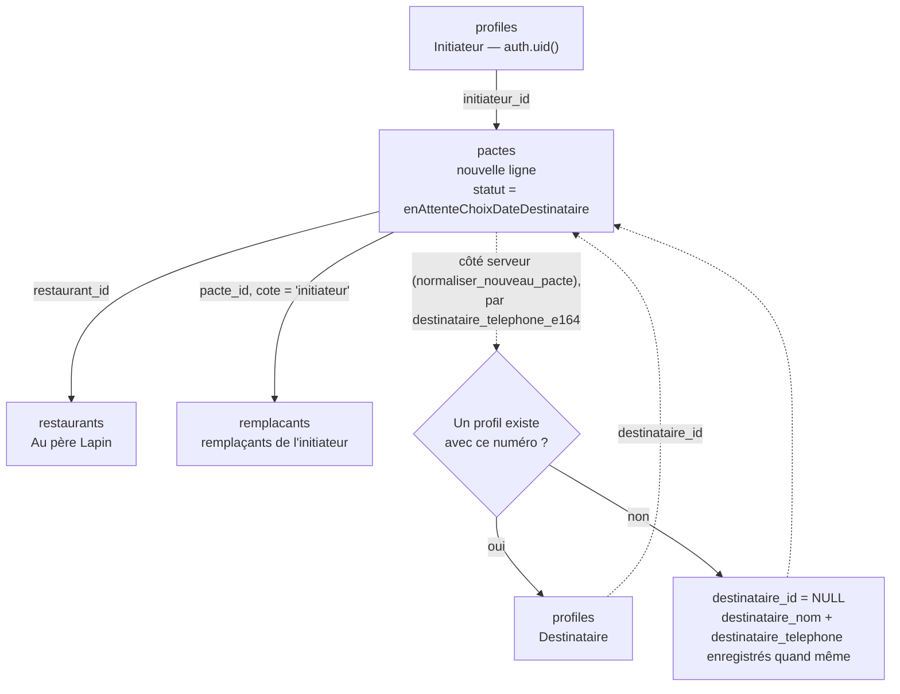
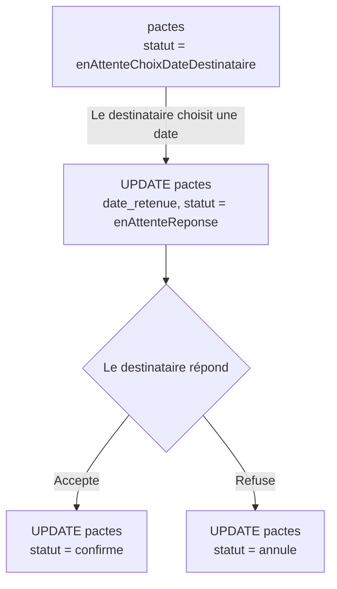
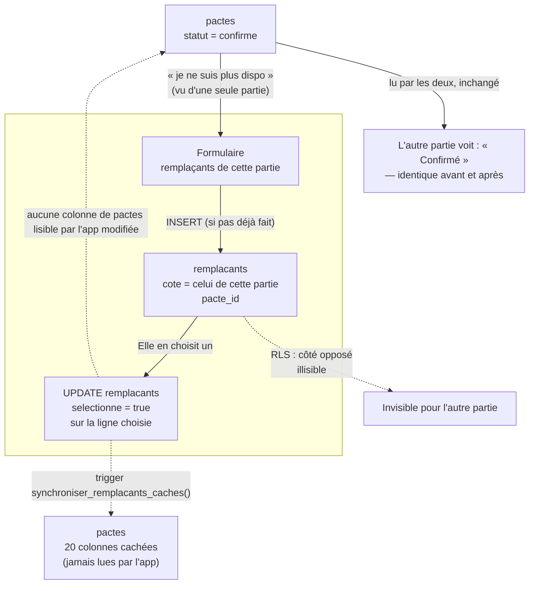
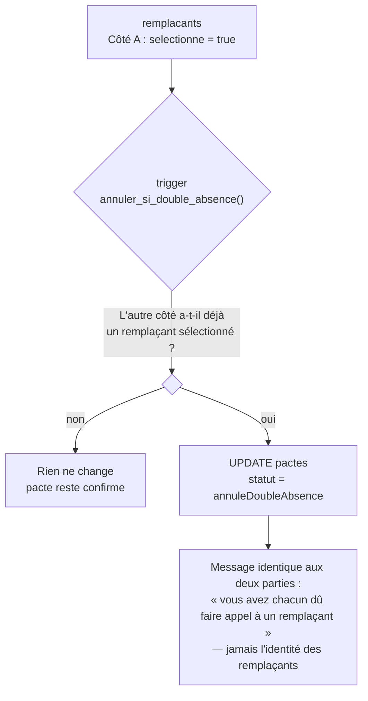
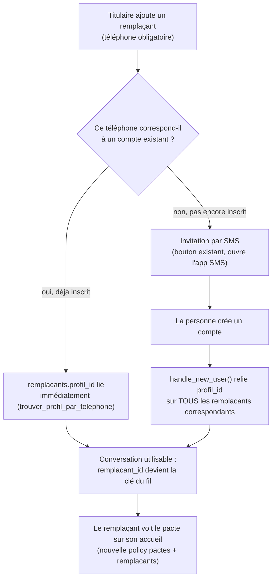

# Synthèse technique — Swend

> **À maintenir à jour.** Ce document décrit l'état réel du produit et du code à un instant donné. Toute session de développement qui touche au schéma de données, aux règles de sécurité, au workflow de déploiement ou à une décision d'architecture doit mettre ce fichier à jour dans le même commit — pas après coup. Dernière mise à jour : **25 septembre 2026**.

## 1. Le produit

**Swend** (renommée depuis "Pakt" le 23/09, elle-même renommée depuis "Le Pacte" le 03/09 — nom et nom de domaine `swend.fr` déjà actés côté produit) est une application où deux personnes fixent d'avance un déjeuner ou un dîner, sans savoir à l'avance qui — du titulaire ou d'un remplaçant — sera réellement présent le jour J. Chaque partie peut, à tout moment avant le jour J, déléguer sa présence à l'un de ses propres remplaçants, sans que l'autre partie ne le sache. Ce secret est la règle produit centrale et elle irrigue tout le modèle de données (section 4).

**V1 : si les deux parties délèguent leur présence, le pacte est annulé automatiquement.** Faire se rencontrer deux remplaçants qui ne se connaissent pas n'est pas géré pour l'instant (peut être gênant). Les deux sont prévenus (dans l'app et par notification push) et peuvent recréer un pacte s'ils le souhaitent — voir section 4 (`statut = annuleDoubleAbsence`) et section 7.4.

## 2. Stack technique

| Couche | Choix | État |
|---|---|---|
| Frontend | Flutter (web + iOS/Android scaffoldés) | Web déployé et utilisé ; iOS/Android jamais publiés |
| Backend | Supabase (Postgres + Auth + Data API/PostgREST + RLS) | En production |
| Notifications push | Firebase Cloud Messaging (FCM), utilisé seul — pas tout Firebase | **Complet et en production (29/08)** : projet Firebase, intégration client, Edge Function, déclencheurs Postgres sur tous les événements, routage au clic. |
| Analytics | PostHog | Prévu, pas encore implémenté |
| Hébergement web | GitHub Pages | En production, https://kevinarner.github.io/le_pacte/ |

Décision backend (voir historique de conversation) : Supabase a été choisi plutôt que Firestore/Firebase complet pour rester en SQL (équipe à l'aise avec SQL, besoin d'analyses facilement requêtables), viser 3+ ans sur les paliers gratuits pour ~5000 utilisateurs, et parce que FCM peut s'utiliser seul sans adopter tout l'écosystème Firebase.

### Dépendances Flutter clés (`pubspec.yaml`)
- `supabase_flutter` — client Supabase (Auth + Data API).
- `image_picker` — sélection de photo (profil), **stockage local uniquement pour l'instant, jamais envoyée à Supabase Storage**.
- `url_launcher` — ouverture du lien restaurant / SMS d'invitation.
- Aucune dépendance ajoutée pour le sélecteur de contacts (03/09) : `lib/services/contact_picker_service.dart` utilise `dart:js_interop`/`dart:js_interop_unsafe`, tous deux dans le SDK Dart — évite d'ajouter `package:web` en dépendance directe rien que pour ça, et évite le piège `flutter clean` (section 3) qui ne concerne que l'ajout d'un vrai plugin.

## 3. Organisation Git & workflow de déploiement

- **Branche de développement** : `claude/github-files-list-vxwef9` — tout le code source y est commité.
- **`main`** : fast-forwardée pour matcher la branche de dev après chaque session (ne contient jamais de commit propre à elle).
- **`gh-pages`** : contient uniquement le **résultat compilé** (`flutter build web`), pas le code source. C'est elle que GitHub Pages sert.

Séquence de déploiement standard :
```bash
flutter build web --release --base-href /le_pacte/
# copier build/web/ sur la branche gh-pages (via un git worktree), commit, push
# puis fast-forward main sur la branche de dev
```
**Après l'ajout d'un nouveau plugin ayant une implémentation web** (`pubspec.yaml` modifié), faire `flutter clean` avant ce build — sinon le fichier généré qui enregistre les plugins web peut rester périmé et silencieusement ignorer le nouveau plugin (voir section 8, bug `shared_preferences` puis `firebase_core`, rencontré deux fois).

## 4. Modèle de données (Supabase / Postgres)

### `profiles`
Un compte = une ligne. `id` = `auth.uid()`. Colonnes : `prenom`, `nom`, `telephone`, `email`.
RLS : chacun ne voit/modifie que sa propre ligne. Créée automatiquement par le trigger `handle_new_user()` (section 5) au moment de l'inscription — jamais insérée depuis l'app.
**Identité et téléphone (chantier téléphone, 25/09)** : `profiles.id` (= `auth.uid()`) est la **seule identité canonique** d'une personne. Le téléphone n'est qu'une **clé de rapprochement** : la colonne générée `telephone_e164` (forme canonique E.164 calculée par `normaliser_telephone()`, section 5) sert à retrouver le compte d'un numéro saisi ailleurs, et à identifier provisoirement un contact qui n'a pas encore de compte. **`telephone_e164` est unique** (index unique partiel `profiles_telephone_e164_unique`, qui remplace l'ancien index sur le texte brut `profiles_telephone_unique` du 27/08) : « 06 70 41 92 77 » et « +33670419277 » sont le même numéro, un seul compte peut l'avoir. Le numéro d'un compte doit être un **mobile valide** (contrainte `profiles_telephone_valide`) et il est **figé après l'inscription** en V1 (trigger `verifier_telephone_profil`, erreur `telephone_fige` si l'app tente de le modifier ; un changement passe par le support). Le numéro d'inscription est **déclaratif, pas vérifié par SMS** : quelqu'un pourrait s'inscrire avec le numéro d'un autre et hériter de ses invitations — risque connu, accepté en V1, vérification OTP à prévoir.

`remplacants.telephone_e164` et `pactes.destinataire_telephone_e164` sont les colonnes générées équivalentes (mobiles valides obligatoires pour toute nouvelle ligne : contraintes `remplacants_telephone_valide`, `pactes_destinataire_telephone_valide`). Une même personne (même `telephone_e164`) ne peut figurer qu'une fois par côté d'un Swend (index unique `remplacants_personne_unique_par_cote`).

### `restaurants`
Un seul restaurant en dur aujourd'hui (« Au père Lapin »), avec ses créneaux réels de déjeuner/dîner. Plusieurs restaurants proposés au choix est une évolution prévue mais pas commencée.
RLS : lecture publique pour `authenticated` (`using (true)`) — les infos du restaurant ne sont pas confidentielles. **Cette policy manquait initialement** (bug corrigé le 24/08 : la RLS était activée sans policy de lecture, ce qui bloquait tout accès avec une erreur 406 — voir section 8).

### `pactes`
La ligne partagée entre les deux parties. Deux catégories de colonnes bien distinctes :

**Colonnes accordées à `authenticated`** (lisibles/écrivables par l'app) : `id`, `type`, `statut`, `dates_proposees`, `date_retenue`, `nombre_echanges_date`, `restaurant_id`, `initiateur_id`, `initiateur_nom`, `destinataire_id`, `destinataire_nom`, `destinataire_telephone`, `created_at`.

**20 colonnes jamais accordées à `authenticated`** : `initiateur_remplacant_{1..5}_{nom,telephone}` et `destinataire_remplacant_{1..5}_{nom,telephone}`. Elles existent uniquement pour garder un historique permanent de « qui a remplacé qui », **lisible seulement via l'éditeur SQL Supabase ou le `service_role`**, jamais par l'app cliente — même après la fin du pacte. Remplies automatiquement par un trigger (section 5), jamais écrites par le code Flutter.

Ce cloisonnement colonne-par-colonne (`GRANT SELECT (col1, col2, ...) ON pactes TO authenticated`, tout le reste implicitement refusé) est le mécanisme qui rend ces 20 colonnes invisibles à l'app, en complément de la RLS classique (qui, elle, filtre les *lignes*, pas les colonnes).

`statut` (enum, valeurs exactes utilisées dans le code et en base) :
`enAttenteChoixDateDestinataire` → `enAttenteChoixDateInitiateur` (allers-retours de négociation de date, plafonnés à 2) → `enAttenteReponse` → `confirme` → `maintenu`, `annule`, ou `annuleDoubleAbsence` (les deux parties ont délégué leur présence — voir section 5 et 7.4).

Important : **aucun champ de statut de présence n'existe sur `pactes`**. Ni l'initiateur ni le destinataire ne peuvent lire, même indirectement, si l'autre partie a délégué sa présence — cette information vit exclusivement dans `remplacants`, cloisonnée par côté (voir ci-dessous). C'est une correction volontaire par rapport à une première version du schéma qui stockait un statut de présence par côté directement sur `pactes`.

### `remplacants`
Une ligne par remplaçant potentiel, propre à un pacte et à un côté (`cote` = `'initiateur'` ou `'destinataire'`) : `pacte_id`, `cote`, `prenom`, `nom`, `telephone` (obligatoire côté app depuis le 27/08 — nécessaire pour relier un compte), `email`, `selectionne` (booléen — celui-ci a été délégué), `profil_id` (nullable — rempli une fois que ce remplaçant a créé un compte, voir section 5 et 7.5).
RLS SELECT : **le titulaire du côté concerné**, OU **le remplaçant lui-même** une fois `profil_id` lié à son compte (ajouté le 27/08 — la policy initiale ne couvrait que le titulaire, pas le remplaçant, qui ne pouvait donc pas savoir sur quels pactes il avait été ajouté).
Plafond : `RemplacantsForm.maximum` (5) ne limite plus que le nombre de fiches **saisies d'un coup** dans un formulaire ; aucun plafond métier par côté (décision du 25/09). Vérifié : rien en base n'empêche une 6ᵉ fiche — `synchroniser_remplacants_caches()` ne recopie simplement que les rangs 1 à 5 dans les 20 colonnes cachées de `pactes` (historique manuel), les suivants n'y apparaissent pas. Le formulaire de création d'un Swend garde son maximum de 5 à la saisie.
**`demande_statut`** (24/09, élargi le 25/09 ; texte nullable, `null`/`'envoyee'`/`'refusee'`/`'cloturee'`/`'acceptee'`/`'desistee'`) — cycle de vie d'une demande "Un imprévu ?" (voir 7.6, transitions complètes). `selectionne` garde exactement son sens d'origine ("cette personne se présentera le jour J") : il ne passe à `true` que lorsque la personne sollicitée **accepte**, jamais au clic du titulaire.
**Écritures (25/09, migration `un_imprevu_v2.sql`)** : `UPDATE` et `DELETE` directs sur `remplacants` sont **révoqués** pour `authenticated`/`anon`. L'app ne peut plus qu'y faire des `INSERT` (gestion de la liste), eux-mêmes normalisés par le trigger `normaliser_nouveau_remplacant()` (section 5). Toute transition d'une demande et tout retrait passent par des fonctions `SECURITY DEFINER` (section 5) — les règles "consentement", "une seule personne prend la place", "transfert définitif" et "personne engagée de l'autre côté = indisponible" sont garanties par la base, pas par l'interface. Avant cette date, un titulaire pouvait techniquement se passer du consentement par un `UPDATE ... set selectionne = true` direct (policy UPDATE du titulaire), même si l'app ne le faisait plus.

### `messages`
Un fil de discussion privé par remplaçant (`remplacant_id`, `expediteur_id`, `contenu`, `created_at`) — pas de `pacte_id`/`cote` dupliqués, ils se retrouvent via `remplacant_id`. Voir section 7.5.
RLS : lisible/écrivable par le titulaire du côté concerné OU par le remplaçant lié (`remplacants.profil_id = auth.uid()`). Realtime activé (`alter publication supabase_realtime add table messages`) pour la réception en direct.

### `device_tokens`
Un token FCM par appareil/navigateur (`profile_id`, `token`, `plateforme`, `created_at`). Contrainte d'unicité sur `token` (le client fait un `upsert(onConflict: 'token')` à chaque connexion), FK `profile_id → profiles(id) on delete cascade`. RLS : chacun ne gère que ses propres tokens (`profile_id = auth.uid()`) ; la future fonction serveur d'envoi lira toutes les lignes via la clé `service_role`, qui contourne RLS.

### `suggestions_restaurant` et `messages_contact` (03/09)
Écriture seule côté app, pour le sous-menu "Nous contacter" du hub (`lib/services/contact_repository.dart`). `suggestions_restaurant` : `profile_id`, `nom`, `lien` (nullable), `created_at`. `messages_contact` : `profile_id`, `objet`, `message`, `created_at`. RLS : `insert` uniquement, réservé à `profile_id = auth.uid()` — aucune policy `select`, les soumissions sont consultées directement dans le Dashboard Supabase, pas depuis l'app. Le formulaire "Autres" stocke pour l'instant sans envoyer de vrai email : aucune boîte de contact n'existe encore côté infra.

## 5. Fonctions & déclencheurs `SECURITY DEFINER`

Ces fonctions tournent avec les droits du propriétaire de la base, pas ceux de l'utilisateur connecté — elles contournent volontairement RLS/grants pour des opérations précises que l'app ne doit jamais faire elle-même.

- **`handle_new_user()`** — trigger `after insert` sur `auth.users`. Crée la ligne `profiles` correspondante, rattache automatiquement tout pacte en attente dont `destinataire_telephone` correspond au numéro du nouvel inscrit (met à jour `destinataire_id`), ET (depuis le 27/08) relie de la même façon tous les `remplacants.profil_id` correspondants — potentiellement plusieurs à la fois, un même numéro pouvant apparaître sur plusieurs pactes. Non modifiée par le chantier téléphone : sa comparaison sur le texte brut est désormais complétée par `rattacher_nouveau_profil()` ci-dessous, qui compare les formes canoniques.
- **Chantier téléphone (25/09 — migrations `telephones_phase1.sql` puis `telephones_phase2.sql`)** : tous les rapprochements par numéro se font **côté serveur** et sur la forme E.164 ; un `destinataire_id` ou un `profil_id` envoyé par l'app n'est **jamais** considéré comme fiable. Codes d'erreur métier ajoutés : `telephone_invalide`, `personne_est_participant`, `personne_deja_prevue`, `destinataire_est_initiateur`, `telephone_fige`, `modification_interdite`.
  - **`normaliser_telephone(text) returns text`** (`immutable`) — forme canonique E.164 d'un numéro de **mobile**, ou `null` : séparateurs ignorés (espaces, espaces insécables, `.`, `(`, `)`, `/`, tirets), `+` ou `00` = indicatif, 10 chiffres sans indicatif = numéro français, `(0)` après l'indicatif retiré, mobiles d'outre-mer ramenés à leur indicatif (0692/0693/0639 → +262, 0690/0691 → +590, 0694 → +594, 0696/0697 → +596), France : 06/07 uniquement, autres pays : E.164 plausible (8 à 15 chiffres, non vérifiable finement). **Réécrite à l'identique en Dart** (`lib/utils/telephone.dart`, 42 vecteurs de test communs + 6 007 entrées comparées par fuzzing, 0 divergence) pour valider tout de suite dans les formulaires — la base reste la seule autorité.
  - **`verifier_telephone_profil()`** — trigger `before insert or update of telephone` sur `profiles` : numéro invalide → `telephone_invalide` (une inscription avec un numéro invalide ou déjà pris échoue, l'app affiche un message générique) ; modification par l'app → `telephone_fige`.
  - **`rattacher_nouveau_profil()`** — trigger `after insert` sur `profiles` : rattache, par `telephone_e164`, les pactes dont `destinataire_id` est vide (jamais si le nouvel inscrit est l'initiateur) et les fiches `remplacants` dont `profil_id` est vide (jamais sur un Swend dont il est participant). Ne remplace jamais un lien existant.
  - **`normaliser_nouveau_pacte()`** — trigger `before insert` sur `pactes` : numéro invalide → `telephone_invalide` ; `destinataire_id` **recalculé** à partir de `destinataire_telephone_e164` (la valeur envoyée par l'app est ignorée, l'app n'en envoie d'ailleurs plus) ; se choisir soi-même → `destinataire_est_initiateur`.
  - **`proteger_participants_pacte()`** — trigger `before update` sur `pactes` : l'app ne peut plus modifier `initiateur_id`, `destinataire_id` ni `destinataire_telephone` d'un Swend existant (`modification_interdite`) ; seuls les triggers serveur le font.
  - **`trouver_profil_par_telephone()`** — compare désormais les formes canoniques, et n'est **plus exécutable par l'app** (`revoke execute` pour `anon`/`authenticated`) : elle ne sert plus qu'aux triggers. L'app ne peut pas rechercher un compte par numéro.
  - **`destinataire_a_un_compte(p_telephone text) returns boolean`** (26/09, migration `destinataire_a_un_compte.sql`) — seule exception, uniquement pour une personne que l'utilisateur est en train d'ajouter lui-même dans un formulaire. Appelée par un seul composant, `StatutSwend` (`lib/widgets/statut_swend.dart`), utilisé partout où l'on saisit le numéro d'une personne ajoutée : étape 1 "Avec qui ?", étape 3 et acceptation d'un Swend, "Personnes de confiance" (via `RemplacantsForm`), et "Ajouter quelqu'un" dans "Un imprévu ?". Règle unique : numéro vide, invalide ou refusé par le formulaire → rien ; compte → "[Prénom] est déjà sur Swend", sans invitation ; pas de compte → "[Prénom] n'a pas encore Swend" + "Envoyer l'invitation" ("Cette personne" tant que le prénom est vide). Dans "Un imprévu ?", pas de bouton dans le formulaire : le message d'urgence est proposé juste après l'envoi de la demande. Les fiches déjà enregistrées de "Personnes de confiance" gardent "A rejoint Swend / N'a pas encore rejoint Swend", calculé par la base (`profil_id`). Répond oui / non uniquement (jamais d'identifiant ni de nom), rien (`null`) pour un numéro invalide ou son propre numéro, et au plus **20 numéros différents par utilisateur sur 24 h glissantes** (table `verifications_destinataire`, illisible par l'app) — au-delà, pas de réponse et l'écran propose l'invitation comme avant. Limite connue : ce quota freine mais n'empêche pas totalement de tester quelques numéros depuis cet écran.
- **`synchroniser_remplacants_caches()`** — trigger `after insert/update/delete` sur `remplacants`. Recopie chaque remplaçant dans l'emplacement fixe correspondant parmi les 20 colonnes cachées de `pactes`, via `row_number() over (partition by cote order by id)`. C'est le seul mécanisme qui écrit dans ces 20 colonnes.
- **`trouver_profil_par_telephone(p_telephone text) returns uuid`** — ne renvoie qu'un UUID (ou rien), jamais les autres champs du profil. Longtemps appelée directement par l'app (création d'un pacte, ajout d'un remplaçant) ; depuis la phase 2 du chantier téléphone (25/09), réservée aux triggers serveur (voir ci-dessus).
- **`annuler_si_double_absence()`** — trigger `after insert or update of selectionne` sur `remplacants`. Quand un côté sélectionne un remplaçant, vérifie si l'autre côté en a déjà un sélectionné pour ce même pacte ; si oui, bascule `pactes.statut` sur `annuleDoubleAbsence`. Doit obligatoirement tourner en `SECURITY DEFINER` : c'est le seul endroit du système qui a le droit de comparer les deux côtés d'un même pacte, l'app cliente n'ayant jamais accès aux remplaçants de l'autre partie (RLS par côté, section 4). Depuis le 29/08, notifie aussi les deux parties (voir plus bas).
- **`notifier(p_profile_id, p_title, p_body, p_data)`** — fonction commune (29/08) utilisée par tous les déclencheurs de notification ci-dessous. Appelle l'Edge Function `send-notification` via `pg_net` (requête HTTP asynchrone, ne bloque jamais la transaction), authentifiée avec la clé `service_role` lue dans le **Vault** de Supabase (secret `service_role_key_notifications` — jamais en clair dans le code). Toute erreur interne (secret manquant, etc.) est avalée et journalisée en warning : l'envoi d'une notification ne doit jamais faire échouer l'action réelle.
- **`notifier_nouveau_pacte()`** — trigger `after insert` sur `pactes`. Notifie le destinataire (si son compte existe déjà) : "{Prénom} te propose de faire un pacte."
- **`notifier_reponse_pacte()`** — trigger `after update of statut` sur `pactes`. Couvre toute la négociation de date (contre-propositions, choix, confirmation, annulation) en déduisant qui notifier uniquement à partir de `old.statut`/`new.statut` (le déroulé est déterministe, voir `bloc_choix_date.dart`/`bloc_reponse.dart`) — pas besoin de `auth.uid()`. Distingue notamment un refus explicite (`old.statut = enAttenteReponse`) d'un abandon faute de date trouvée (`old.statut = enAttenteChoixDateXxx`), avec des textes différents. Exclut explicitement `annuleDoubleAbsence`, qui a sa propre notification. La notification "Pacte confirmé" inclut le nom du restaurant (`restaurants.nom`, via `restaurant_id`).
- **`notifier_nouveau_message()`** — trigger `after insert` sur `messages`. Détermine le destinataire (titulaire ou remplaçant, celui qui n'a pas écrit) en comparant `expediteur_id` à l'id du titulaire du pacte. Inclut le téléphone du remplaçant dans les données de la notification (pour le bouton d'appel au clic) uniquement dans le sens titulaire←remplaçant : dans l'autre sens, `ChatScreen` le récupère déjà via `telephone_titulaire_du_pacte()`.
- **`formater_date_heure_fr(p_date)`** — formatage français ("vendredi 16 octobre à 19h00") écrit à la main (tableaux de jours/mois), Postgres/Supabase n'ayant pas de locale française par défaut.
- **`est_remplacant_du_pacte(p_pacte_id uuid) returns boolean`** — utilisée par la policy SELECT de `pactes` qui laisse un remplaçant voir le pacte concerné (section 7.5). Ne peut pas être un simple `exists (select 1 from remplacants ...)` inline dans la policy : les policies de `remplacants` interrogent `pactes` en retour, ce qui crée une récursion infinie (`infinite recursion detected in policy for relation "pactes"`, code `42P17` — bug rencontré le 27/08, voir section 8). Passer par une fonction `SECURITY DEFINER` casse la boucle, puisqu'elle contourne la RLS de `remplacants` pour cette vérification précise.
- **`telephone_titulaire_du_pacte(p_remplacant_id uuid) returns text`** — permet au bouton d'appel du chat de fonctionner côté remplaçant : renvoie le téléphone du titulaire, uniquement si l'appelant est bien le remplaçant lié à cette ligne (`profil_id = auth.uid()`). Dans l'autre sens (titulaire appelant son remplaçant), aucune fonction n'est nécessaire : le titulaire a déjà ce numéro dans son propre formulaire.
- **Fonctions "Un imprévu ?"** (24/09, refondues le 25/09 — migration `un_imprevu_v2.sql`, à exécuter après `un_imprevu.sql` et `garde_fou_double_remplacement.sql`). Toutes `SECURITY DEFINER`, toutes vérifient elles-mêmes qui appelle, et toutes verrouillent **d'abord la ligne `pactes` puis toutes les fiches `remplacants` du pacte (les deux côtés)**, toujours dans cet ordre : deux actions concurrentes sur un même Swend sont sérialisées sans risque d'interblocage, et chaque fonction relit la fiche **après** verrouillage (le perdant d'une course voit donc toujours l'état final du gagnant). Codes d'erreur métier renvoyés à l'app (`PacteRepository.codeErreurMetier`) : `place_deja_prise`, `personne_indisponible`, `deja_remplacant_autre_cote`, `demande_non_active`, `deja_acceptee`, `retrait_impossible`, `swend_inactif`, `champs_manquants`.
  - **`envoyer_demande_remplacement(id)`** (titulaire du côté) — `null → envoyee`. Refuse si le Swend n'est plus `confirme`, si quelqu'un a déjà pris la place de ce côté (le parcours est terminé), si la fiche n'est pas "jamais sollicitée", ou si la même personne (`profil_id`) a pris la place de l'autre côté.
  - **`annuler_demande_remplacement(id)`** (titulaire du côté) — `envoyee → null`. Refuse (`deja_acceptee`) dès que la personne a accepté : transfert définitif.
  - **`repondre_demande_remplacement(id, accepte)`** (la personne sollicitée, `profil_id = auth.uid()`) — `envoyee → refusee` ou `envoyee → acceptee` + `selectionne = true`. À l'acceptation : toutes les `envoyee` du même côté passent `cloturee` ; **les fiches de cette même personne de l'autre côté** (`null` ou `envoyee`) passent aussi `cloturee` — affichées "Indisponible" à l'autre titulaire, sans raison, sans notification. Garde-fou conservé : impossible d'accepter si on a déjà pris la place de l'autre côté. Refusée si le Swend n'est plus `confirme` (après une annulation pour double remplacement, les demandes restées en attente ne peuvent plus être acceptées).
  - **`se_desister_du_remplacement(id)`** (la personne qui avait accepté) — `acceptee → desistee`, `selectionne = false`. Rouvre la recherche : les `cloturee` du même côté redeviennent `null` (sauf une personne engagée de l'autre côté), les `refusee`/`desistee` restent indisponibles ; ses propres fiches de l'autre côté, clôturées parce qu'elle s'était engagée ici, redeviennent `null` si personne n'a pris la place de ce côté-là. Aucune notification.
  - **`retirer_remplacant(id)`** (titulaire du côté) — supprime la fiche et son fil de discussion. Possible si jamais sollicitée, refusée, clôturée ou désistée ; refusé (`retrait_impossible`) si demande en attente (il faut d'abord l'annuler) ou si la personne a accepté.
  - **`ajouter_et_demander_remplacement(pacte, cote, prenom, nom, telephone)`** (titulaire du côté) — ajout + envoi de la demande en **une seule transaction** (tout ou rien) : si la demande ne peut pas partir, l'ajout est annulé aussi. Pas de plafond.
  - **`normaliser_nouveau_remplacant()`** — trigger `before insert` sur `remplacants`. Toute fiche naît non sélectionnée et jamais sollicitée (un `INSERT` forgé ne peut plus s'auto-désigner), son `profil_id` est recalculé côté serveur à partir de `telephone_e164` (un `profil_id` envoyé par le client est ignoré), et si la personne a déjà pris la place de l'autre côté de ce Swend, la fiche naît `cloturee` ("Indisponible"). Depuis la phase 2 du chantier téléphone : numéro invalide → `telephone_invalide` ; **un participant du Swend (initiateur ou destinataire, par compte ou par numéro) ne peut pas être remplaçant** → `personne_est_participant` ; une personne déjà prévue de ce côté → `personne_deja_prevue`. Verrouille la ligne `pactes` pour être sérialisé avec les fonctions ci-dessus.
- **`notifier_demande_remplacement()`** — trigger `after update of demande_statut` sur `remplacants`. Notifie la personne sollicitée dans deux cas seulement : quand une demande lui est envoyée ("On a besoin de toi"), et quand sa demande en attente est clôturée parce que quelqu'un d'autre a accepté ("C'est bon, quelqu'un a pu prendre la place." — jamais qui). **Aucune** notification quand la clôture vient du fait qu'elle-même vient de prendre la place de l'autre côté (25/09), ni sur annulation, refus, désistement ou réouverture. Réutilise le type `chat` (au clic : ouvre le fil, où se trouve le bandeau de réponse). Pas de notification au titulaire pour l'instant (voir "Prévu, pas commencé").
- **`annuler_si_double_absence()`** relu par l'utilisateur le 25/09 : ignore tout cas où `new.selectionne` n'est pas `true` — un désistement (`true → false`) ne déclenche donc rien. Règle V1 confirmée : si un côté a une personne sélectionnée et que l'autre côté en sélectionne une aussi, le Swend passe `annuleDoubleAbsence`, et dans ce cas seulement les deux titulaires peuvent savoir que chacun avait fait appel à quelqu'un (jamais qui).

## 6. Authentification

- Supabase Auth, email + mot de passe. Confirmation d'email **activée** (`Confirm email` = ON).
- **Site URL** Supabase configuré sur `https://kevinarner.github.io/le_pacte/` (piège initial : reste par défaut sur `http://localhost:3000`, ce qui casse le lien de confirmation reçu par email — voir section 8).
- `AppStore.moi` (`lib/services/app_store.dart`) est l'unique source de vérité de l'identité connectée. Remplacée après un login/signup réussi par `LoginScreen._chargerProfilEtEntrer()`, qui va chercher la ligne `profiles` correspondante.
- **Le mécanisme de simulation « Moi / Mon ami » (`perspectiveMoi`)**, utilisé dans les premières versions pour tester les deux côtés d'un pacte dans un seul navigateur, **a été entièrement retiré**. Il était devenu incompatible avec RLS : la sécurité au niveau ligne résout toujours l'identité *réellement* connectée (`auth.uid()`), quel que soit un éventuel bouton de bascule dans l'UI.

## 7. Cycle de vie d'un pacte

### 7.1 Création



Si le destinataire n'a pas encore de compte, `destinataire_id` reste `NULL` mais rien n'est perdu : `destinataire_nom` et `destinataire_telephone` sont conservés, et `rattacher_nouveau_profil()` rattachera automatiquement le pacte dès que cette personne créera un compte avec le même numéro, quelle que soit la façon dont il a été écrit.

### 7.2 Acceptation ou refus



La négociation de date (contre-proposition) est plafonnée à 2 allers-retours (`nombreEchangesDate` / `maxEchangesDate` dans `bloc_choix_date.dart`) ; au-delà, la seule option restante est d'accepter une des dates proposées ou d'annuler.

### 7.3 Accepté, puis délégué à un remplaçant



Point clé : la substitution ne touche **aucune colonne lisible par l'app** sur `pactes`. L'autre partie n'a littéralement aucune donnée lui indiquant qu'une substitution a eu lieu — pas seulement un nom caché. Le trigger `synchroniser_remplacants_caches()` écrit bien un historique sur `pactes`, mais dans les 20 colonnes jamais accordées à `authenticated` : cet historique n'existe que pour une consultation manuelle via l'éditeur SQL, jamais pour l'app.

### 7.4 Les deux délèguent : annulation automatique (V1)

Décision V1 (24/08) : faire se rencontrer deux remplaçants qui ne se connaissent pas n'est pas géré pour l'instant — si les deux parties délèguent, le pacte est annulé plutôt que de les mettre en contact.



Points volontaires de cette conception :
- **Annulation immédiate**, dès la seconde délégation — pas d'attente d'une échéance J-1.
- **Le message révèle le fait mutuel** (les deux ont délégué) **mais jamais l'identité** des remplaçants — cohérent avec la règle de secret, puisque ce fait-là ne devient vrai, et donc partageable, que lorsqu'il concerne les deux parties à la fois.
- **Pas de notification push pour l'instant** : la partie qui délègue en second voit le changement immédiatement (l'app relit le statut juste après son action) ; l'autre partie le verra en rouvrant l'app. Un vrai push sera branché sur cet événement une fois FCM en place.

### 7.5 Chat titulaire ↔ remplaçants (27/08)

Objectif produit : donner une raison de revenir régulièrement dans l'app, et faire connaître l'app via les remplaçants invités. Un fil de discussion privé s'ouvre automatiquement dès qu'un remplaçant crée un compte — pour **tous** les remplaçants potentiels d'un côté (jusqu'à 5), pas seulement celui finalement délégué.



Décisions retenues :
- **Un fil par (pacte, remplaçant)**, pas un fil persistant qui traverserait plusieurs pactes — colle au modèle actuel où un remplaçant est ressaisi à chaque pacte (pas de liste de contacts réutilisable).
- **Accessible en permanence** une fois le pacte confirmé, pas seulement au moment de se désister : `MesRemplacantsScreen` (qui remplace l'ancien `ChoisirRemplacantScreen`) permet d'ajouter des remplaçants à tout moment, avant même d'en avoir besoin.
- **Le destinataire renseigne aussi ses remplaçants pour accepter** (`BlocReponse`), symétriquement à l'initiateur qui le fait déjà à la création — sinon son chat resterait vide en pratique.
- Deux policies RLS ont dû être **ajoutées** (pas remplacées) pour que ce flux fonctionne : un remplaçant doit pouvoir voir sa propre fiche `remplacants` et le `pactes` concerné, ce qu'aucune policy existante ne permettait (elles ne couvraient que les titulaires).

### 7.6 "Un imprévu ?" — remplacement avec consentement (24/09, refondu le 25/09)

Décisions produit structurantes :
- Un Swend reste un Swend même si l'un des deux participants est remplacé — jamais présenté comme "quitter"/"annuler sa participation". **L'autre participant ne sait absolument rien** (ni notification, ni nom différent, ni statut, ni indice) — sauf dans le seul cas d'une annulation pour double remplacement (7.4).
- **Gestion ≠ demande.** `MesRemplacantsScreen` ("Personnes de confiance") = préparation uniquement : voir, ajouter (bouton "Enregistrer"), retirer, discuter, inviter par SMS. Aucune demande n'en part. Seul le parcours "Un imprévu ?" (`ImprevuScreen`) envoie une vraie demande.
- **Plusieurs demandes en parallèle**, sans ordre ni priorité. **La première acceptation enregistrée gagne** (garanti par la base, testé en concurrence réelle : 40/40 courses avec un seul gagnant). **Accepter = transfert définitif** : le titulaire ne peut plus annuler ni récupérer sa place ; seul le désistement de la personne qui a accepté rouvre la recherche. Le titulaire reste responsable de son côté, la personne qui prend la place ne devient pas administratrice.
- **Pas de plafond** de personnes pendant un imprévu : si personne n'est disponible, l'action principale est "Ajouter quelqu'un" (ajout + demande en une seule action) ; "Annuler le Swend" reste secondaire, en dernier recours (annulation de la réservation non gérée, pas de pénalité).
- **Même personne prévue des deux côtés** : possible ; dès qu'elle accepte d'un côté, elle devient "Indisponible" de l'autre, sans raison ni notification, et ne peut plus y être sollicitée (garanti par la base).

**Transitions** (`remplacants.demande_statut`, toutes via les fonctions de la section 5) :

| État | Action (qui) | Nouvel état | `selectionne` | Effet sur les autres fiches |
|---|---|---|---|---|
| — | Ajout (titulaire, gestion) | `null` (ou `cloturee` si la personne a déjà pris la place de l'autre côté) | `false` | aucun |
| — | "Ajouter quelqu'un" pendant l'imprévu (titulaire) | `envoyee` directement | `false` | aucun (tout ou rien) |
| `null` | "Lui demander" (titulaire) | `envoyee` | `false` | aucun |
| `null`, `refusee`, `cloturee`, `desistee` | "Retirer" (titulaire) | fiche supprimée | — | aucun |
| `envoyee` | "Annuler la demande" (titulaire) | `null` | `false` | aucun |
| `envoyee` | "Refuser" (personne sollicitée) | `refusee` | `false` | aucun |
| `envoyee` | "Accepter" — gagne | `acceptee` | → `true` | `envoyee` du même côté → `cloturee` ; ses fiches `null`/`envoyee` de l'autre côté → `cloturee` |
| `envoyee` | "Accepter" — perd la course | (déjà `cloturee` par le gagnant) | `false` | — (erreur `place_deja_prise`) |
| `acceptee` | "Je ne peux finalement plus venir" (elle) | `desistee` | → `false` | `cloturee` du même côté → `null` ; ses `cloturee` de l'autre côté → `null` ; `refusee`/`desistee` inchangées |
| `refusee`, `desistee` | — | inchangé | `false` | terminal pour ce Swend ("Indisponible") |

"Annulée par le titulaire" n'a pas d'état dédié : revenir à `null` est strictement équivalent à "jamais sollicitée" (même affichage, même actions) et ne déclenche aucune notification.

**Rôles — `PerspectivePacte` (`lib/models/perspective_pacte.dart`)** : titulaire initiateur, titulaire destinataire, ou **tiers** (ma propre fiche remplaçant, la seule que la RLS me laisse voir ; si je suis prévu des deux côtés, priorité à la fiche où je prends la place, puis à une demande en attente). Utilisé par `DetailPacteScreen`, "Mes Swends", le hub et le profil — **plus aucun repli implicite "pas initiateur donc destinataire"** (avant le 25/09, une personne prévue qui ouvrait un Swend depuis son accueil était traitée comme le destinataire, avec ses blocs et ses actions).

**Répartition des écrans** :
- `DetailPacteScreen` : routeur. Titulaire → corps habituel (inchangé). Tiers → `BlocTiers`, corps séparé et minimal (aucun bloc titulaire ne peut s'y afficher par erreur).
- `BlocTiers` (tutoiement) : maison du statut du tiers. Toujours : date, heure, restaurant, avec qui. Puis selon l'état — prévu jamais sollicité ("Eliot peut faire appel à toi en cas d'imprévu" + "Écrire à Eliot") ; demande en attente ("Eliot a un imprévu", rappel de la règle du mystère, "Voir la demande et répondre" → conversation) ; refusé/clôturé/désisté (texte informatif) ; a accepté ("Tu prends la place d'Eliot", "Écrire à Eliot", **"Je ne peux finalement plus venir"** — seul endroit de cette action). Aucune action de gestion, de date, d'annulation, ni de contact avec l'autre participant (aucun fil n'existe entre eux).
- `ChatScreen` : **seul endroit où Accepter/Refuser s'exécute** (confirmation avant d'accepter), avec tout le contexte avant de décider (qui demande, date, heure, restaurant, avec qui, règle du mystère). Pour les autres états, un rappel d'une ligne + lien "Voir le Swend". La messagerie titulaire ↔ personne reste disponible dans tous les états.
- `ImprevuScreen` (titulaire, vouvoiement) : accès direct à "Qui peut prendre votre place ?" (plus d'écran d'intro), "Lui demander" (personne déjà sur Swend) ou **"Inviter et demander"** (pas encore de compte, 26/09 : la demande part et le choix Messages / WhatsApp s'ouvre aussitôt avec le message d'urgence — une seule action ; ces personnes restent toujours listées) / "En attente" (+ "Annuler la demande", "Écrire à…" ou "Envoyer le SMS" si pas encore sur Swend) / "Indisponible" ; "Ajouter quelqu'un" ; vue "X prendra votre place" une fois acceptée. Une personne sans compte reçoit un **SMS d'urgence** explicite (date, heure, autre participant, restaurant, règle du mystère, lien), proposé juste après l'envoi de la demande.
- `BlocPresence` (titulaire) : "X prendra votre place" une fois acceptée, sinon la liste des prénoms (nettoyés : "Kevin, Sylvain, t") + deux actions côte à côte (26/09) : **"Modifier ma liste"** (`MesRemplacantsScreen`, renommé ainsi : voir les personnes et leur statut Swend, inviter, ajouter, retirer — plus de "Discuter" sur les cartes) et **"Discuter"** (choix d'une conversation parmi les personnes de la liste déjà sur Swend ; les autres n'y figurent pas). **"Un imprévu ?"** est un vrai bouton (contour) sous ce bloc. Trois intentions séparées : préparer / discuter / demander.

**Confidentialité vérifiée** : aucune colonne de `pactes` lisible par l'app n'est touchée ; toutes les nouvelles lectures (`PerspectivePacte`, contexte du tiers) reposent sur les policies existantes (fiche où `profil_id = moi`, pacte via `est_remplacant_du_pacte`) ; l'autre titulaire ne voit, au plus, qu'une de ses propres fiches passer à "Indisponible" (cas de la même personne prévue des deux côtés) — jamais pourquoi, jamais de notification. Testé en base (réplique locale, rôle `authenticated` + `auth.uid()` simulé).

## 8. Bugs rencontrés et corrigés (pour ne pas les refaire)

| Symptôme | Cause | Correction |
|---|---|---|
| "Impossible de joindre le serveur" au login/signup, aucune requête réseau visible | `MissingPluginException` sur `shared_preferences` en web — enregistrement de plugin périmé après ajout de `supabase_flutter` | `flutter clean` + `flutter pub get` + rebuild |
| Lien de confirmation d'email renvoie vers `localhost:3000` et une page d'erreur | Site URL Supabase resté sur sa valeur par défaut | Authentication → URL Configuration → Site URL = URL de prod, + ré-inscription pour un lien frais |
| Écran d'accueil bloqué sur un chargement infini après connexion | RLS activée sur `restaurants` sans aucune policy de lecture → 406 de Supabase, et aucune gestion d'erreur côté app pour l'afficher | Policy `using (true)` sur `restaurants` + gestion d'erreur explicite (message + bouton Réessayer) dans `AccueilScreen`/`CreerPacteScreen` |
| La policy initiale de `remplacants` laissait chaque partie voir les remplaçants de l'autre | La condition RLS vérifiait "ce pacte m'appartient" sans vérifier "ce côté est le mien" | Policy réécrite pour vérifier `cote = 'initiateur' and initiateur_id = auth.uid()` (et son symétrique) |
| `PostgrestException: infinite recursion detected in policy for relation "pactes"` (code `42P17`) au chargement de l'accueil | La policy laissant un remplaçant voir le pacte concerné interrogeait `remplacants`, dont les policies interrogent `pactes` en retour — boucle infinie | Passer par la fonction `SECURITY DEFINER` `est_remplacant_du_pacte()`, qui contourne la RLS de `remplacants` pour cette vérification et casse la boucle |
| Le destinataire d'un pacte ne voyait pas la proposition, alors qu'elle avait bien été créée | Deux comptes différents avaient le même numéro de téléphone (aucune contrainte ne l'empêchait) ; `trouver_profil_par_telephone()` (`... limit 1`) a résolu vers le mauvais profil, donc `destinataire_id` ne pointait pas vers le bon compte | Index unique partiel sur `profiles.telephone` (`where telephone <> ''`) — empêche désormais deux comptes de partager un numéro, avec un message clair à l'inscription si ça arrive |
| `PostgrestException: new row violates row-level security policy for table "pactes"` (code 42501) à la création d'un pacte, alors que l'utilisateur était bien connecté | Plusieurs onglets du même navigateur connectés à des comptes différents : la session Supabase est partagée via le stockage local, se connecter ailleurs remplace silencieusement celle utilisée par les autres onglets, sans que `AppStore.moi` ne s'y resynchronise — RLS a bloqué à raison une écriture avec un `initiateur_id` qui ne correspondait plus à la session réelle | `RootShell` écoute `onAuthStateChange` et force une reconnexion avec un message clair dès que la session change sous ses pieds |
| Page blanche au chargement (28/08), puis `PlatformException(channel-error, Unable to establish connection on channel: "...FirebaseCoreHostApi.initializeCore")` une fois le crash rattrapé | Même famille que le bug `shared_preferences` ci-dessus, avec `firebase_core`/`firebase_messaging` cette fois : le fichier généré `web_plugin_registrant.dart` (celui qui appelle `XxxWeb.registerWith(registrar)` pour chaque plugin) n'avait jamais été régénéré depuis leur ajout — `FirebaseCoreWeb` n'y figurait pas, donc jamais enregistré, donc tree-shaké du bundle final. Diagnostiqué en reproduisant en local avec Chromium headless (Playwright) + interception réseau vers une copie locale de CanvasKit, le sandbox n'ayant pas accès à gstatic.com | `flutter clean` avant le rebuild force la régénération de ce fichier. **Retenu pour la suite : toujours faire `flutter clean` après l'ajout d'un nouveau plugin avec une implémentation web**, avant même de tester — ce bug s'est maintenant produit deux fois pour la même raison |
| `[firebase_messaging/failed-service-worker-registration] ... 404 ... firebase-messaging-sw.js` au moment d'obtenir le token FCM (web) | `firebase_messaging_web` cherche le service worker à la racine du domaine par défaut, alors que l'app est servie dans le sous-dossier `/le_pacte/` (GitHub Pages) | Passer `serviceWorkerScriptPath: 'firebase-messaging-sw.js'` à `getToken()` — résolu relativement à `<base href>` |
| `PostgrestException ... violates check constraint "device_tokens_plateforme_check"` en enregistrant le token | La contrainte n'autorisait que `'ios'`/`'android'`, pas `'web'` | Contrainte élargie à `'ios','android','web'` ; côté Dart, `defaultTargetPlatform.name` normalisé en minuscules (il renvoie `'iOS'` avec un O majuscule, qui aurait échoué pareil sur un vrai appareil iOS) |
| `AbortError: Failed to execute 'subscribe' on 'PushManager' ... no active Service Worker` en enregistrant le token FCM (web), même après les corrections ci-dessus | Le service worker interne de Flutter (`flutter_service_worker.js`, déprécié, cache hors-ligne) et celui de FCM (`firebase-messaging-sw.js`) partagent le même scope (même dossier) : l'enregistrement/mise à jour permanente de celui de Flutter empêchait celui de FCM de rester actif | `web/flutter_bootstrap.js` personnalisé (repris du template par défaut de Flutter, mécanisme découvert en lisant le code source de `flutter_tools`) qui appelle `_flutter.loader.load({})` sans `serviceWorkerSettings` — désactive le SW interne de Flutter, qu'on n'utilise pas de toute façon. En complément : le SW de FCM est maintenant aussi enregistré dès le chargement de la page (`web/index.html`) plutôt qu'au moment de la connexion, pour lui laisser le temps de s'activer, avec une nouvelle tentative automatique en cas d'échec transitoire |
| Le bouton "Accepter le pacte" restait grisé même une fois les 2 remplaçants du destinataire entièrement remplis (29/08) | Dans `RemplacantsForm`, les champs téléphone/email appelaient `r.telephone = v` mais oubliaient `widget.onChanged()` (contrairement à prénom/nom) : `BlocReponse` ne se reconstruisait donc pas après la saisie du téléphone, alors que `estRempli` (et donc le bouton) en dépend | `widget.onChanged()` ajouté aux deux champs |
| `MesRemplacantsScreen` affichait "N'a pas encore rejoint l'application" pour un remplaçant dont le compte était pourtant bien lié en base (25/09, repéré en testant "Un imprévu ?") | Contrairement à `ImprevuScreen`, cet écran affichait uniquement `widget.cotePacte.listeRemplacants` tel que chargé en mémoire au moment où `DetailPacteScreen` a ouvert le pacte, sans jamais se resynchroniser à l'ouverture — un `profil_id` lié après ce chargement restait donc invisible tant que l'app n'était pas rechargée entièrement | Ajout de `_rafraichir()` dans `initState()` : recharge la liste depuis le serveur et met à jour en place les fiches déjà enregistrées (par `id`), sans toucher aux nouvelles fiches en cours de saisie (sans `id`) |
| Une personne "prévue en cas d'imprévu" qui ouvrait un Swend depuis son propre accueil voyait la fiche du **destinataire** (ses blocs, "Un imprévu ?", "Annuler le Swend"...) (repéré lors du diagnostic du 25/09) | `DetailPacteScreen`, "Mes Swends", le hub et le profil déduisaient le rôle d'un simple `initiateur_id == moi` : tout le reste tombait implicitement dans "destinataire", alors que la RLS laisse déjà un tiers voir le pacte | Rôle explicite `PerspectivePacte` (titulaire initiateur / destinataire / tiers) partout ; corps dédié `BlocTiers` ; suppression par balayage désactivée pour un tiers ; statistiques du profil limitées aux Swends dont on est titulaire |
| Une personne ajoutée dans "Personnes de confiance" n'était jamais enregistrée en base, sauf si on lui envoyait ensuite une demande ; la croix ✕ d'une fiche déjà enregistrée ne la supprimait que localement | L'enregistrement des nouvelles fiches n'était déclenché que par "Lui demander" (`synchroniserRemplacants` dans `_demander`) ; aucune suppression serveur n'existait | Bouton "Enregistrer" explicite pour les nouvelles personnes ; personnes enregistrées affichées en cartes séparées avec un vrai "Retirer" (`retirer_remplacant()`) |
| Un titulaire pouvait techniquement se désigner un remplaçant sans son accord (ou annuler une acceptation) par une écriture directe | La policy UPDATE du titulaire sur `remplacants` restait ouverte à toutes les colonnes, même si l'app ne l'utilisait plus pour `selectionne` | `UPDATE`/`DELETE` directs révoqués ; toutes les transitions via fonctions `SECURITY DEFINER` ; `INSERT` normalisé par trigger (section 5) |
| Kevin, déjà inscrit, n'était pas reconnu quand Eliot le renseignait comme personne de confiance ("N'a pas encore rejoint Swend") alors que David, avec le même numéro, le voyait bien lié (25/09) | Les numéros étaient comparés en texte brut : « 06 70 41 92 77 » (saisi par Eliot) ≠ « +33670419277 » (saisi par David) ≠ « 0670419277 » (numéro du compte). L'index unique sur le texte brut laissait aussi passer deux comptes avec le même numéro écrit différemment | Chantier téléphone : forme canonique E.164 calculée en base (`telephone_e164`), toutes les comparaisons et l'unicité portent dessus, rattachement uniquement côté serveur (sections 4 et 5) |

## 9. État actuel

**Fait et déployé :**
- Authentification réelle (Supabase Auth), création de profil automatique, rattachement automatique par téléphone.
- Cycle de vie complet d'un pacte : création, négociation de date (max 2 allers-retours), acceptation/refus, délégation à un remplaçant, statuts `confirme`/`maintenu`/`annule`/`annuleDoubleAbsence`.
- Annulation automatique si les deux parties délèguent leur présence (V1 — pas de mise en contact entre remplaçants).
- Chat privé en temps réel entre un titulaire et chacun de ses remplaçants, dès que ceux-ci ont un compte — ouverture automatique par rattachement téléphone, écran permanent pour gérer sa liste et déléguer.
- Confidentialité par côté appliquée à la fois par RLS (lignes) et par grants de colonnes (historique permanent invisible à l'app).
- **Notifications push (FCM), de bout en bout** (28-29/08) : projet Firebase (`le-pacte-e6c17`, apps Android/iOS/Web), intégration client (`lib/services/notification_service.dart` : permission, token, sauvegarde dans `device_tokens`, bannière in-app si l'app est au premier plan), Edge Function d'envoi (`supabase/functions/send-notification`, API FCM v1 via compte de service), déclencheurs Postgres sur les 4 événements (nouveau pacte, réponse à un pacte avec tous ses sous-cas, message de chat, double absence — voir section 5), et routage au clic sur une notification vers le bon pacte/chat (`navigatorKey`, `PacteRepository.pacteParId()`). Vérifié en conditions réelles (notification système reçue). Plusieurs bugs corrigés au passage (voir section 8).
- **Refonte navigation/UX** (29/08), palette pêche/bleu ardoise/crème (voir `AppColors` dans `lib/theme/app_theme.dart` — couleur d'erreur `erreur` distincte de l'accent). Plus de barre de navigation basse : après connexion, un **menu principal** (`lib/screens/root/menu_principal_screen.dart`) donne accès à quatre sections — Mes Pactes, Messagerie, Profil, Nous contacter — chacune poussée via `Navigator.push` et ramenant au menu via le logo dans son `AppBar` (`Navigator.pop`). Onglet **Messagerie** (`lib/screens/messagerie/messagerie_screen.dart`) qui regroupe tous les fils de discussion où je suis impliqué, titulaire ou remplaçant, via `PacteRepository.mesFilsDeDiscussion()` — une seule requête sur `remplacants` suffit : la RLS existante renvoie déjà l'union "mes propres remplaçants" et "mes fiches de remplaçant" pour un même utilisateur ; chaque fil affiche aussi la date et le restaurant du pacte concerné (03/09). Pas de suivi lu/non-lu pour cette première version (décision explicite). Le bouton "+ Nouveau pacte" devient une icône flottante (mains détourées, réutilise les PNG du logo — `assets/images/`). **Création de pacte scindée en 3 étapes** (avec qui / où et quand / remplaçants) avec indicateur de progression. **Profil enrichi** : pactes réalisés, remplacements effectués (`PacteRepository.nombreRemplacementsEffectues()`), taux de fiabilité (part des pactes `confirme`/`maintenu` parmi tous les pactes arrivés à un statut terminal). L'animation d'ouverture "boule de papier" prévue dans la maquette n'est pas encore intégrée : en attente d'une nouvelle image de la part de l'utilisateur.
- **Renommage en "Pakt", "Nous contacter", sélection de contacts, vraies modifications de compte** (03/09) :
  - "Le Pacte" remplacé par "Pakt" partout dans l'app (login, titre, hub, invitations SMS, `web/index.html`, `web/manifest.json`, labels Android/iOS) — les identifiants de package/URL (`le_pacte`, `com.kevinarner.le_pacte`/`lePacte`) sont volontairement inchangés, ce sont des identifiants techniques, pas du texte affiché.
  - Logo (mains entrecroisées) ajouté sur l'écran de connexion.
  - Nouvelle catégorie **Nous contacter** sur le hub : suggestion de restaurant (`suggestions_restaurant`, section 4) et formulaire "Autres" (`messages_contact`, section 4 — pas encore de vrai envoi d'email, boîte de contact pas encore créée). Le lien "ici" de l'étape "Où et quand ?" de la création de pacte ouvre directement le formulaire de suggestion, avec retour à l'étape en cours via le bouton retour standard.
  - Étapes "Avec qui ?" et "Tes remplaçants" (`lib/widgets/remplacants_form.dart`) : champ email retiré, remplacé par un bouton "Choisir dans mes contacts" quand la Contact Picker API du navigateur est disponible (`ContactPickerService.disponible`) — **Android + Chrome uniquement à ce jour** (ni iOS Safari, ni desktop) ; ailleurs le bouton est simplement absent, la saisie manuelle reste l'unique option. Implémenté via `dart:js_interop`/`dart:js_interop_unsafe` plutôt que `package:web`, cf. section 2.
  - **Profil → Mes informations** (`lib/screens/profil/mes_informations_screen.dart`) : Nom et Téléphone non modifiables (le téléphone est figé depuis le chantier téléphone du 25/09 : affiché au format lisible, avec une note expliquant comment en changer via "Aide / Nous contacter"), Email/Mot de passe affichent la vraie valeur et un bouton "Modifier" avec persistance réelle (`lib/services/profil_repository.dart`) — email et mot de passe via `Supabase.auth.updateUser()` (le changement d'email nécessite de cliquer le lien de confirmation envoyé par Supabase avant de prendre effet, comme pour l'inscription).
- **Renommage en "Swend"** (23/09) : "Pakt" remplacé par "Swend" partout dans l'app (titre, hub, invitations SMS, `web/index.html`, `web/manifest.json`, labels Android/iOS) — mêmes identifiants de package/URL volontairement inchangés qu'au renommage précédent (voir "Prévu, pas commencé"). Sur l'écran de connexion et le hub, le texte "Pakt"/"Swend" est remplacé par une image du logotype manuscrit fourni par l'utilisateur (`assets/images/logo_swend_wordmark.png`, fond rendu transparent, encre recolorée pour matcher `AppColors.texte`) — **wordmark explicitement temporaire**, une version définitive suivra. Un nom de domaine `swend.fr` et un site vitrine statique (repo séparé `swend-site-vitrine`, hébergé sur GitHub Pages) existent déjà pour la marque, indépendamment de cette app.
- **Refonte UX du hub : "chaque Swend est un objet autonome"** (23/09). Décision produit structurante : la messagerie n'est plus une section indépendante de l'app — `lib/screens/messagerie/messagerie_screen.dart` a été supprimé, il n'y a plus d'écran listant tous les fils de discussion tous pactes confondus. Chaque conversation est désormais rattachée à son pacte via `BlocPresence` sur `DetailPacteScreen` (voir la passe vocabulaire ci-dessous pour son habillage actuel).
  - Hub (`menu_principal_screen.dart`) restructuré selon la hiérarchie "quel est mon prochain Swend ? est-ce que quelque chose nécessite mon attention ? comment créer/retrouver mes Swends ?" : carte "TON PROCHAIN SWEND", puis une éventuelle carte de notification de message ("{nom} vous a écrit"), puis un bouton `FilledButton` très visible **"Créer un Swend"** (accès direct à `CreerPacteScreen` depuis le hub), puis la tuile "Mes Swends" (`X à venir`, badge si une action est requise), puis "Profil" en simple ligne discrète (plus de tuile-carte). "Nous contacter" n'apparaît plus sur le hub : déplacé dans Profil sous une ligne "Aide / Nous contacter".
  - **Notification de nouveau message sans vrai suivi lu/non-lu** : `FilDeDiscussion` gagne un champ `dernierMessageDeMoi` (comparaison de `expediteurId` avec l'utilisateur courant, calculé dans `PacteRepository.mesFilsDeDiscussion()`) ; le hub affiche le fil le plus récent dont le dernier message n'est pas de moi. **Ce n'est pas un vrai lu/non-lu** : aucun état de lecture n'est persisté, donc la carte peut réapparaître à chaque ouverture du hub tant qu'on n'a pas répondu dans ce fil précis — limitation connue, acceptée pour cette itération (un vrai suivi demanderait une colonne/table de "dernière lecture", pas construite ici).
- **Suppression d'un Swend depuis "Mes Swends"** (23/09) : sur `AccueilScreen`, chaque carte de pacte est balayable (`Dismissible`, swipe de droite à gauche) avec confirmation (`AlertDialog` destructif) avant suppression définitive. Côté base, une fonction `SECURITY DEFINER` `supprimer_pacte(p_pacte_id uuid)` (migration livrée à l'utilisateur, à exécuter manuellement dans le SQL Editor Supabase) vérifie que l'appelant est bien l'initiateur ou le destinataire du pacte puis supprime en cascade `messages` → `remplacants` → `pactes` — nécessaire car les remplaçants sont cloisonnés par côté via RLS et un DELETE client classique ne pourrait pas franchir cette frontière pour l'autre côté. Exposée côté app via `PacteRepository.supprimerPacte(String pacteId)`.
- **Passe de cohérence vocabulaire "Swend"** (23/09) : suite explicite pour généraliser à toute l'interface visible le vocabulaire "simple, humain, légèrement mystérieux, chaleureux, jamais administratif" et éviter les mots "Pacte", "relais" et "remplaçant" — texte uniquement, modèle de données et noms de classes/routes inchangés (`Pacte`, `Remplacant`, `pactes`, `remplacants`, `RemplacantsForm`, `MesRemplacantsScreen`, `BlocPresence` restent tels quels en interne).
  - "Pacte avec X" → "**Swend avec X**" partout où c'était affiché (cartes "Mes Swends", titre `DetailPacteScreen`, wizard de création "Nouveau Swend" / "Envoyer le Swend", boutons "Accepter/Refuser le Swend", "Annuler le Swend", messages d'erreur, textes d'invitation SMS, stat "Swends réalisés" du profil).
  - Badge "Confirmé" → "**Scellé**" (voir aussi la passe "badges orientés action" ci-dessous, qui remplace complètement l'ancien badge générique "Date à confirmer").
  - `BlocPresence` : section "Mon relais" → "**EN CAS D'IMPRÉVU**", qui explique la fonction plutôt que de nommer le rôle ("Peut prendre votre place" / bouton "Écrire à {prénom}" / lien "Modifier cette personne" si quelqu'un est désigné ; "Choisissez une personne de confiance" / bouton "Choisir une personne" sinon). `MesRemplacantsScreen` (accessible depuis ces boutons) renommée "Personnes de confiance" dans l'UI, ainsi que `RemplacantsForm` ("Ajouter une personne", "Personne {n}") et les textes d'invitation SMS associés — même traitement dans le wizard de création et `BlocReponse`/`BlocEpilogue` (`BlocCascade` a depuis été supprimé, voir plus bas).
  - Notification de message sur le hub : le texte fixe "À propos de votre Swend" est remplacé par un contexte dynamique **"Swend avec {autre partie} · {date} à {heure}"**. Nouveau champ `FilDeDiscussion.autrePartieNom` (calculé dans `PacteRepository.mesFilsDeDiscussion()` à partir de `cote` et des noms initiateur/destinataire du pacte) — distinct de `nomInterlocuteur`, qui peut être la personne de confiance plutôt que l'autre titulaire.
  - Carte "TON PROCHAIN SWEND" élargie à 82 % de la largeur disponible (`FractionallySizedBox`), centrée, sans changer son style.
  - FAB (icône mains) supprimé sur `AccueilScreen` : la création se fait déjà depuis le bouton "Créer un Swend" du hub ; le texte d'état vide de cet écran a été adapté en conséquence.
- **Badges de statut orientés action** (23/09) : le badge d'un Swend en négociation ne décrit plus l'état technique ("Date à confirmer") mais qui doit agir — `lib/theme/app_theme.dart` gagne `pacteEstMonTour(StatutPacte, bool jeSuisInitiateur)` (logique unique de "à qui le tour", déjà présente en double dans `DetailPacteScreen` et le hub — celle du hub, `_actionRequise`, a été récrite pour l'appeler au lieu de dupliquer les mêmes comparaisons ; celle de `DetailPacteScreen`, `estMonTourDate`/`estMonTourReponse`, distingue en plus *quel type* d'action — choix de date vs réponse — pour savoir quel bloc afficher, donc n'a pas été fusionnée) et `statutAffichagePourMoi(StatutPacte, {jeSuisInitiateur, autrePrenom})`, qui renvoie un libellé + un style (`StatutAffichage`) : **"À vous de répondre"** (fond `AppColors.accent` plein, texte blanc — seul badge volontairement plus visible que les autres, sans rouge/alerte) quand c'est mon tour, sinon **"En attente de {prénom de l'autre}"** (style discret, transparent + contour, déjà utilisé pour les statuts de négociation) ; "Scellé" et les statuts terminaux (`Maintenu ✅`, `Annulé ✗`) inchangés. Utilisé par `AccueilScreen._cardPacte` et le badge en tête de `DetailPacteScreen`. Le prénom est simplement le premier mot de `nomTitulaire` (aucune colonne prénom séparée n'existe côté pacte — introduire un vrai champ prénom n'était pas nécessaire ici).
  - **Tri de "Mes Swends"** : priorité — voir la micro-itération ci-dessous pour l'ordre actuel (mon tour → scellé → j'attends l'autre → terminé/annulé) —, puis par `dateRetenue` croissante à l'intérieur de chaque groupe. Pas de sections séparées, un seul tri (`AccueilScreen._trierParPriorite`), calculé une fois après le chargement.
- **Micro-itération UX : ordre, wording, fiche d'un Swend scellé** (23/09).
  - **Ordre de "Mes Swends" revu** : mon tour (0) → **scellé, trié chronologiquement** (1) → j'attends l'autre partie (2, visible mais plus discret qu'un scellé à venir) → terminé/annulé (3). Départage stable par `dateRetenue` puis par `id` si tout est égal (`AccueilScreen._priorite`/`_trierParPriorite`).
  - **Prénom seul, centralisé** : nouvelle fonction `prenomDe(String)` dans `lib/utils/noms.dart` (premier mot d'un nom complet), qui remplace 3 copies du même one-liner (`AccueilScreen`, `DetailPacteScreen`, le hub) — utilisée pour les badges "En attente de {prénom}" et pour la notification de message du hub, qui affiche désormais le prénom de l'autre partie plutôt que son nom complet ("Swend avec David · 13 octobre à 19h00").
  - **Message d'attente reformulé** sur un Swend non scellé (`DetailPacteScreen`, bloc `BlocAttente`) : "En attente du choix de date de X."/"En attente de la réponse de X." remplacés par "{Prénom} peut choisir cette date ou en proposer une autre." (pluriel automatique : "une de ces dates ... d'autres" si plusieurs dates sont proposées) ou "{Prénom} peut accepter ce Swend ou le refuser." — même logique `jAttendsLAutrePartie`/`estMonTourReponse` qu'avant, seul le texte change.
  - **Singulier/pluriel** sur le libellé "Date(s) proposée(s)" du détail (`LigneInfo`), déjà correct sur les cartes "Mes Swends".
  - **Fiche épurée** : suppression de la ligne "Avec X" (redondante avec le titre "Swend avec X"), toujours. Une fois une date retenue (`dateRetenue != null`), elle s'affiche directement sans étiquette "Date :" (les propositions encore en cours gardent leur étiquette "Date(s) proposée(s)", car ce ne sont pas encore *la* date). Le restaurant retenu (`restaurantRetenu`, présent dès la confirmation, y compris pour un Swend `maintenu` ou `annuleDoubleAbsence`) n'affiche plus l'URL brute : son nom en gras, suivi d'un lien "Voir le restaurant ↗" qui réutilise `_reserverLaTable()` (même mécanisme que le bouton "Réserver la table", pas de nouvelle logique).
- **Micro-itération UX : parcours "Créer un Swend"** (23/09) — wording et présentation uniquement, aucune règle métier touchée (`_peutValiderEtape`, minimum de 2 personnes, envoi du pacte inchangés).
  - Étape 1 "Avec qui ?" : phrase d'intro ajoutée, texte SMS reformulé en "Cette personne n'a pas encore Swend ?" (même reformulation appliquée dans `RemplacantsForm`, partagée avec l'étape 3, `MesRemplacantsScreen` et `BlocReponse`).
  - Étape 2 "Où et quand ?" → **"Quand et où ?"**, contexte discret "Swend avec {prénom}" ajouté (comme à l'étape 3), type de repas en `SegmentedButton` au lieu de deux `RadioListTile` verticaux (même état `type`, juste un autre widget), texte des dates proposées reformulé dynamiquement ("Propose une ou plusieurs dates.\n{Prénom} choisira celle qui lui convient."), carte restaurant alignée sur le même style que la fiche d'un Swend scellé (en-tête "RESTAURANT PROPOSÉ", lien "Voir le restaurant ↗" au lieu de l'URL brute).
  - Étape 3 "Tes personnes de confiance" → **"En cas d'imprévu"** (même intitulé que la section correspondante sur la fiche d'un Swend confirmé), texte reformulé "Choisis au moins 2 personnes qui pourraient prendre ta place si nécessaire.\n{Prénom} ne verra jamais cette liste."
  - Le prénom du destinataire vient directement de `prenomDestinataireController` (champ Prénom dédié dès l'étape 1, pas de découpage d'un nom complet nécessaire) — nouveau getter `_prenomDestinataire`.
  - Barre de progression sortie de la `ListView` et épinglée en haut de l'écran (`Column` + `Expanded(ListView(...))`) : elle ne défile plus hors champ sur l'étape 3, plus longue (jusqu'à 5 personnes de confiance) — c'était la seule cause de son "absence" perçue, la logique des segments actifs (`i <= etape`) n'avait pas changé.
  - `DatesForm` (partagé avec la contre-proposition de date sur un Swend en négociation, `bloc_choix_date.dart`) condensée en une seule ligne par date (`ListTile` avec le sélecteur d'horaire et le bouton de suppression en `trailing`, au lieu d'une deuxième ligne "Horaire :" séparée) — même comportement (tap sur la date pour la changer, menu déroulant pour l'horaire, croix pour retirer si au-dessus du minimum), juste plus compact.
- **Correctif glyphe cassé** (24/09) : le caractère "↗" utilisé pour "Voir le restaurant ↗" (fiche d'un Swend scellé et carte restaurant de l'étape 2 du wizard) n'existe pas dans la police Georgia de l'app et s'affichait comme un carré vide — remplacé par `Icons.north_east`. Trouvé en faisant réellement tourner l'app dans un navigateur (voir méthode ci-dessous), pas en relisant le code.
- **Reformulation des SMS d'invitation** (24/09) : nouveau texte pour les deux SMS envoyés depuis le parcours de création — invitation au Swend (`CreerPacteScreen._inviterParSms`) et invitation d'une personne de confiance (`RemplacantsForm._inviterParSms`, partagé avec "Personnes de confiance" et l'écran d'acceptation). Contenu uniquement : mécanisme d'envoi (`sms:...?body=...`), numéro et lien inchangés ; le second SMS ne mentionne plus de date/heure (`_phraseDate` devenue inutile, retirée). Les deux messages ont été vérifiés en interceptant réellement l'appel `launchUrl` dans un navigateur pour lire le texte final généré, pas en relisant le code.
- **Méthode de test de la logique SQL** (25/09, réutilisable) : Postgres 16 est installé dans l'environnement de Claude Code. Une réplique locale minimale du schéma (tables, policies RLS, rôles `anon`/`authenticated`, `auth.uid()` lu depuis un réglage de session comme Supabase le lit depuis le JWT, `notifier()` remplacé par une table de journal) permet d'appliquer les vraies migrations dans l'ordre et d'exécuter des scénarios "en tant que" chaque utilisateur (RLS et GRANT appliqués), y compris des courses réellement concurrentes entre connexions séparées. Les fonctions non versionnées (`annuler_si_double_absence`, cache historique) y sont reconstruites d'après leur description — la réplique ne remplace pas un test sur le vrai projet Supabase, mais valide la logique avant de livrer une migration.
- **Accueil d'une personne de confiance** (26/09) — trou de câblage repéré en test réel : les états tiers existaient (`PerspectivePacte`, `BlocTiers`, `ChatScreen`) et la base laissait déjà Kevin lire le Swend d'Eliot et sa propre fiche, mais le menu principal (`MenuPrincipalScreen`) ne montrait rien d'autre que "Mes Swends — 0 à venir" (un simple rôle n'y compte pas, à raison) ; une demande "Un imprévu ?" n'y ajoutait qu'une pastille "1" sur la tuile "Mes Swends", sans rien nommer ; le Swend n'était visible qu'en ouvrant "Mes Swends". Ajouté au menu, calculé à partir des mêmes `mesPactes()` + `PerspectivePacte` (aucune nouvelle requête ni logique d'état parallèle) : en tête, une carte **"UNE DEMANDE T'ATTEND"** par demande en attente ("Eliot a un imprévu", "Répondre à la demande" → fiche tiers) ; plus bas, une section **"ON COMPTE SUR TOI"** avec une carte par rôle sans action — prévu ("Eliot compte sur toi pour un Swend", "Voir le Swend") ou ayant accepté ("Tu prends la place d'Eliot"). Rien pour un rôle refusé / clôturé / désisté, ni pour un Swend passé ou annulé. Un rôle prévu ne compte toujours pas dans "à venir" ; une place acceptée, si. Fiche tiers "prévu" : ajout de "Tu n'as rien à faire pour le moment."
- **Méthode de test de bout en bout** (26/09, réutilisable, scratchpad `e2e/`) : l'app réelle (`main.dart`, build web) tourne contre une pile locale de type Supabase — la réplique Postgres avec toutes les migrations livrées, **PostgREST 12** (binaire officiel) et un faux serveur d'authentification (`/auth/v1/token`, JWT HS256 signés avec le même secret que PostgREST, relais `/rest/v1`). Seuls deux fichiers sont modifiés le temps de la build (URL/clé Supabase, attente Firebase bornée à 3 s), puis restaurés. Playwright pilote l'interface compte par compte (Eliot, David, Kevin, Camille) : création du Swend, choix de la date, acceptation, "Un imprévu ?", réponse — la RLS, les triggers et les fonctions s'appliquent réellement. Limites : pas de Realtime (la conversation reste en chargement) ni de notifications push ; la réplique reproduit les policies documentées, pas une copie exacte de la production.
- **Méthode de vérification visuelle** (24/09, réutilisable) : pour confirmer qu'un changement est bien visible/correct sans compte de test, un point d'entrée Flutter temporaire (`lib/main_preview.dart`, jamais commité) lance l'écran ciblé directement (sans connexion), avec au besoin un stub local de `PacteRepository.restaurant()` pour éviter l'appel réseau Supabase (bloqué depuis cet environnement). Servi en local (`flutter build web -t lib/main_preview.dart --no-web-resources-cdn` + `http-server`) et piloté avec Playwright/Chromium (déjà installés) pour remplir les champs, avancer les étapes et capturer des captures d'écran ou intercepter `window.open` (pour lire l'URL `sms:` sans lancer d'app SMS réelle). Toujours nettoyé (fichier supprimé, stub annulé) avant tout commit.
- **Suppression de la simulation "garde-fou anti-désistement"** (24/09) : `BlocCascade` et son fichier (`lib/screens/detail_pacte/bloc_cascade.dart`) supprimés de `DetailPacteScreen` à la demande de l'utilisateur — c'était un outil de test temporaire (boutons "Simuler J-1..."), pas une fonctionnalité produit. Les vraies relances automatiques J-7/J-3/J-1 restent à construire proprement plus tard (voir "Prévu, pas commencé").
- **"Un imprévu ?" — remplacement avec consentement** (24/09), fonctionnalité centrale du produit. Détail complet en section 7.6 et 5. Résumé : nouvelle colonne `remplacants.demande_statut` (`envoyee`/`refusee`/`cloturee`/`acceptee`) ; nouvel écran `ImprevuScreen` (accessible depuis un lien discret "Un imprévu ?" sous `BlocPresence`, uniquement sur un Swend `confirme`) qui liste les personnes de confiance prévues avec un bouton "Lui demander" par personne (aucune priorité/ordre entre elles, plusieurs demandes actives en parallèle) ; la personne sollicitée répond depuis un bandeau `[Accepter]`/`[Refuser]` ajouté en haut de `ChatScreen` ; l'acceptation passe par la fonction `SECURITY DEFINER` `repondre_demande_remplacement()`, seule à garantir qu'une seule personne peut effectivement prendre la place (verrou en base, pas seulement côté interface) et à clôturer automatiquement les autres demandes en attente ; notification push à la personne sollicitée (envoi + place prise par quelqu'un d'autre) via `notifier_demande_remplacement()`. `MesRemplacantsScreen` ("Personnes de confiance") utilise désormais le même mécanisme de demande ("Lui demander" au lieu de "Le/la désigner" instantané) — il n'existe donc plus qu'une seule façon de devenir "la personne qui prend la place", toujours consentie. Confidentialité vis-à-vis de l'autre participant inchangée (7.3) : rien de nouveau n'est lisible par l'app côté autre partie. Si toutes les personnes prévues refusent, `ImprevuScreen` propose d'annuler le Swend en réutilisant `mettreAJourStatut(pacteId, StatutPacte.annule)` — **l'annulation de la réservation du restaurant n'est pas gérée**, le fonctionnement définitif de la réservation n'étant pas encore stabilisé. Un bug de layout réel (un `OutlinedButton` sans style local héritait d'une largeur minimale infinie du thème global, écrasant le nom de la personne dans la carte) a été trouvé et corrigé en faisant tourner l'écran dans un navigateur, pas en relisant le code — voir méthode de vérification visuelle ci-dessus.
- **Correctifs suite au premier test réel de "Un imprévu ?"** (25/09) :
  - `MesRemplacantsScreen` affichait "N'a pas encore rejoint l'application" pour une personne dont le compte était pourtant bien lié en base : l'écran ne se resynchronisait jamais avec le serveur à l'ouverture, contrairement à `ImprevuScreen`. Ajout de `_rafraichir()` dans `initState()` (voir section 8). **Complété le jour même** : ce premier correctif ne faisait que mettre à jour/ajouter, jamais supprimer — une fiche déjà enregistrée mais depuis supprimée côté serveur (Swend supprimé, ou autre manipulation, avec l'onglet resté ouvert sur l'ancien état) continuait donc de s'afficher indéfiniment, avec des champs figés (ex. "A accepté ✓" alors que la ligne n'existe plus). `_rafraichir()` retire maintenant localement toute fiche avec un `id` absente de la réponse fraîche du serveur.
  - **Indicateur "Déjà sur Swend" en direct pendant la saisie d'un numéro** (étape 1 "Avec qui ?" de `CreerPacteScreen`, et chaque personne dans `RemplacantsForm`, partagé avec "Personnes de confiance" et l'étape 3 du wizard) : jusque-là, le bloc "Cette personne n'a pas encore Swend ? → Inviter par SMS" s'affichait systématiquement, sans jamais vérifier si le numéro tapé correspondait déjà à un compte existant — repéré par l'utilisateur en testant avec un numéro qu'il savait pourtant déjà inscrit. Le numéro est maintenant revérifié via `PacteRepository.trouverProfilParTelephone()` (RPC déjà existante, jusque-là seulement appelée côté serveur à l'enregistrement) après un court délai sans frappe (`Timer` de 500 ms, pour ne pas interroger le serveur à chaque caractère) ; si un compte est trouvé, le bloc SMS est remplacé par "✓ Déjà sur Swend". Purement indicatif : la vraie liaison `profil_id` continue de se faire à l'enregistrement, inchangée. **Retiré le jour même par le chantier téléphone** (décision produit : pas d'indicateur public « ce numéro a un compte Swend », qui permettait de sonder n'importe quel numéro).
  - **Garde-fou : une même personne ne peut pas remplacer les deux participants d'un même Swend** (25/09, migration livrée à l'utilisateur) — repéré en testant : rien n'empêchait Kevin, renseigné comme personne de confiance à la fois par l'initiateur et le destinataire du même pacte, d'accepter les deux demandes séparément (la garantie "une seule personne accepte" de `repondre_demande_remplacement()` ne s'appliquait qu'à l'intérieur d'un même côté, les deux côtés étant des lignes `remplacants` indépendantes). La fonction verrouille désormais toutes les fiches du pacte **des deux côtés** (`for update` sans filtre `cote`, au lieu d'un seul côté) et refuse l'acceptation (exception `deja_remplacant_autre_cote`) si `profil_id = auth.uid()` a déjà `selectionne = true` de l'autre côté du même pacte. `ChatScreen._repondre()` affiche un message dédié pour ce cas ("Tu prends déjà la place de l'autre participant sur ce Swend — impossible de remplacer les deux à la fois."). N'empêche pas d'envoyer une demande à la même personne des deux côtés (juste son acceptation en double) — jugé suffisant, l'essentiel étant que la place ne soit jamais réellement prise en double.

- **"Un imprévu ?" v2** (25/09) — voir 7.6 (règles, transitions, rôles, répartition des écrans) et section 5 (fonctions). Migration `un_imprevu_v2.sql` livrée à l'utilisateur. Scénarios A–I testés sur réplique Postgres locale (75 vérifications + 60 courses concurrentes) et états UX vérifiés dans le navigateur. Choix fait sans règle produit explicite, à confirmer : quand une personne prévue des deux côtés se désiste du côté où elle avait accepté, elle redevient disponible de l'autre côté (l'autre titulaire la voit repasser de "Indisponible" à "Lui demander", sans explication).

- **Chantier téléphone : numéros canoniques E.164** (25/09) — voir section 4 (identité, contraintes) et section 5 (fonctions et triggers). Migrations `telephones_phase1.sql` (sauvegarde, `normaliser_telephone()`, colonnes générées `telephone_e164`, diagnostic en lecture seule) puis `telephones_phase2.sql` (nouvelle sauvegarde horodatée dans le schéma `sauvegarde`, arrêt sans rien modifier si des doublons existent, index uniques canoniques, contraintes "mobile valide" sur les nouvelles lignes, triggers de rattachement/verrouillage, rattrapage des seuls liens vides — aucun lien existant n'est remplacé, aucune donnée fusionnée). Ré-exécutables. Testé sur réplique Postgres locale : 36 vérifications téléphone, scénarios "Un imprévu ?" A–I rejoués (76 vérifications + courses concurrentes), phase 2 appliquée deux fois de suite, et sur des données "sales" (arrêt net avant résolution manuelle, puis rattrapage correct). Côté app :
  - `lib/utils/telephone.dart` : copie Dart de `normaliser_telephone()` (validation immédiate, affichage "06 70 41 92 77" / "0692 12 34 56"), tests dans `test/telephone_test.dart` ;
  - tous les champs numéro s'appellent "Numéro de mobile" et refusent tout de suite un numéro invalide, son propre numéro, celui de l'autre participant du Swend, ou une personne déjà prévue ;
  - l'app n'envoie plus jamais `destinataire_id` ni `profil_id` (calculés par la base) et ne peut plus appeler `trouver_profil_par_telephone` ; l'indicateur "Déjà sur Swend" est retiré ;
  - numéro non modifiable dans "Mes informations".
- **Envoi par Messages ou WhatsApp** (25/09, `lib/widgets/envoi_invitation.dart`) : les trois messages existants (invitation à un Swend, invitation d'une personne de confiance, demande urgente pendant "Un imprévu ?") passent par un bouton "Envoyer l'invitation" / "Envoyer le message" qui ouvre un choix [Messages] / [WhatsApp]. Même texte quel que soit le canal, numéro toujours en E.164 (`sms:+33…?body=`, `https://wa.me/33…?text=`). Si WhatsApp ne s'ouvre pas : "WhatsApp n'a pas pu s'ouvrir." avec une action "Utiliser Messages". Le canal n'est jamais utilisé pour savoir si la personne a un compte.

**Prévu, pas commencé :**
- Vérification du numéro par SMS (OTP) à l'inscription — le numéro est aujourd'hui déclaratif (voir section 4). Prérequis pour permettre ensuite un changement de numéro en libre-service.
- Changement de numéro par l'utilisateur (figé en V1, passe par le support : mise à jour manuelle de `profiles.telephone` dans l'éditeur SQL, la colonne `telephone_e164` se recalcule seule).
- À décider : le statut "A rejoint Swend" / "N'a pas encore rejoint Swend" affiché au titulaire sur ses propres personnes de confiance révèle encore, pour un numéro qu'il a lui-même saisi, si ce numéro a un compte (moins direct que l'ancien indicateur, mais même information).
- "Copier le message" comme troisième canal d'envoi — volontairement repoussé après la V1.
- Envoi d'un vrai email pour le formulaire de contact "Autres" (boîte mail dédiée + prestataire d'envoi à choisir) — les messages sont pour l'instant uniquement stockés dans `messages_contact`.
- Préférences de notifications depuis le profil — ligne encore non fonctionnelle (`"Bientôt disponible"`).
- Animation d'ouverture "boule de papier" à la connexion (en attente de l'image).
- Analytics (PostHog).
- Plusieurs restaurants au choix (un seul en dur aujourd'hui) ; les suggestions reçues via `suggestions_restaurant` sont pour l'instant consultées manuellement, pas encore intégrées à une liste de choix.
- Upload réel des photos de profil/remplaçants (actuellement local au navigateur, jamais envoyé à Supabase Storage).
- Vraies relances automatiques J-7/J-3/J-1 (garde-fou anti-désistement) — la simulation manuelle par boutons (`BlocCascade`) a été retirée le 24/09 en attendant une implémentation propre, voir section "Fait et déployé".
- Identifiants Firebase/stores/package non renommés en cohérence avec "Swend" (décision volontairement reportée) : iOS `com.kevinarner.lePacte`, Android `com.kevinarner.le_pacte`, projet Firebase `le-pacte-e6c17`.
- Wordmark "Swend" définitif — celui en place aujourd'hui est une première ébauche explicitement temporaire fournie par l'utilisateur.
- `ios/` et `android/` sont scaffoldés (`flutter create`) mais l'app n'a jamais été publiée sur aucun store.
- Vrai suivi lu/non-lu des messages (la notification "{nom} vous a écrit" sur le hub est une approximation sans état persisté, voir section 9).
- Annulation de la réservation du restaurant quand un Swend est annulé faute de personne disponible ("Un imprévu ?", section 7.6) — le fonctionnement définitif de la réservation n'est pas encore stabilisé, la V1 se contente d'annuler le Swend lui-même.
- Notifications au titulaire pour "Un imprévu ?" (il voit tout en rouvrant la fiche ou `ImprevuScreen`, pas de push pour l'instant) : acceptation ("Camille prendra votre place." → ouvre la fiche du Swend), désistement ("Camille ne peut finalement plus prendre votre place." → devrait ouvrir directement `ImprevuScreen`, ce qui demandera un nouveau type de notification, ex. `'imprevu'`), éventuellement refus. Le modèle actuel suffit (transitions de `selectionne`/`demande_statut`, nom du titulaire et de la personne, date et restaurant), aucune colonne à ajouter.
- Rappels J-1 / jour J adaptés (titulaire remplacé : "Camille prendra votre place demain à 20h" ; personne qui prend la place : "Rendez-vous avec David demain à 20h · Au Père Lapin" ; autre participant : rappel normal sans indice) — dépend du système de relances pas encore construit.
- Harmonisation tu/vous : les écrans destinés aux personnes prévues/sollicitées sont en tutoiement, les écrans titulaire ("Un imprévu ?", fiche, "En cas d'imprévu") restent en vouvoiement, "Personnes de confiance" en tutoiement — passe de polish globale à faire plus tard.
- Scénario où deux personnes de remplacement pourraient finalement dîner ensemble (double substitution) — explicitement hors V1 pour "Un imprévu ?".
