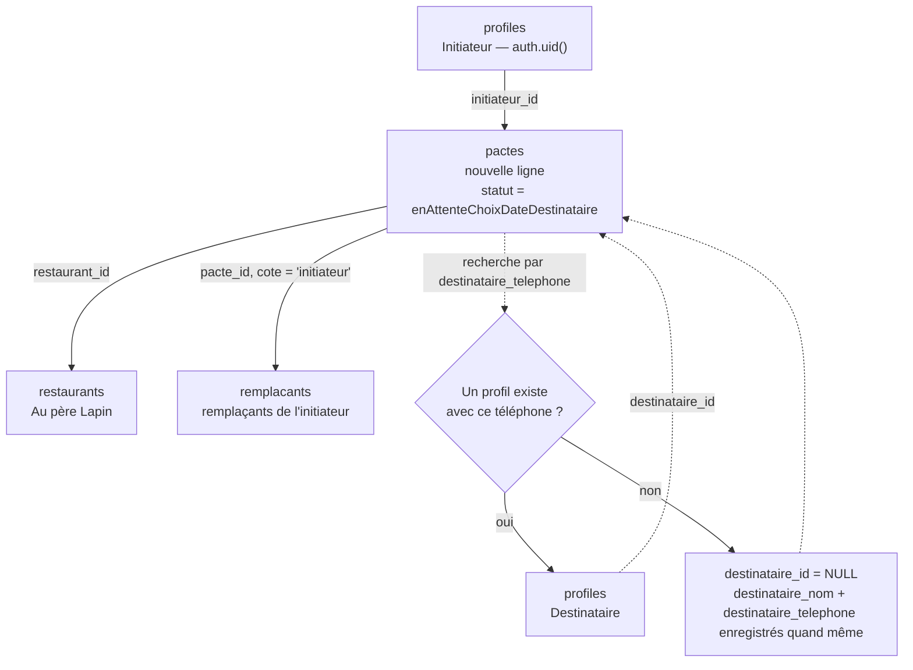
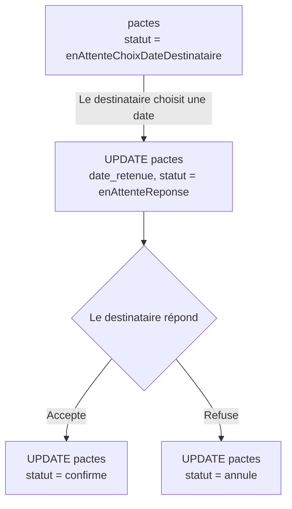
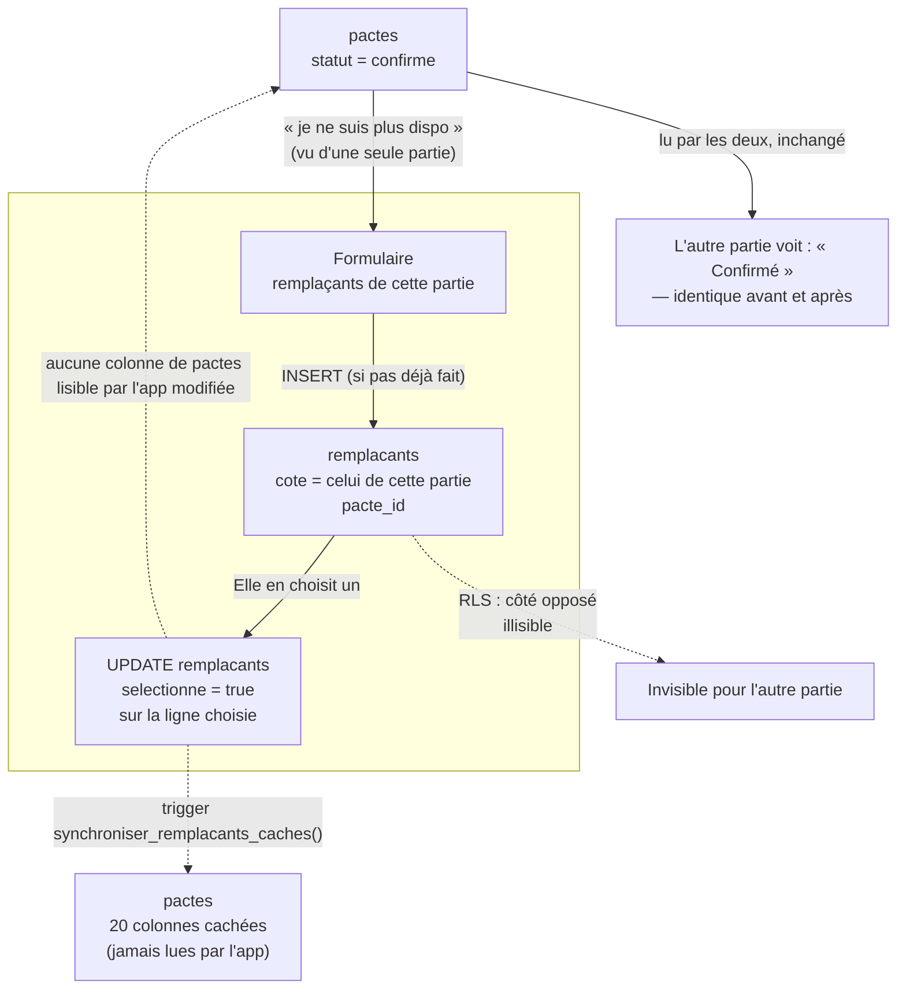
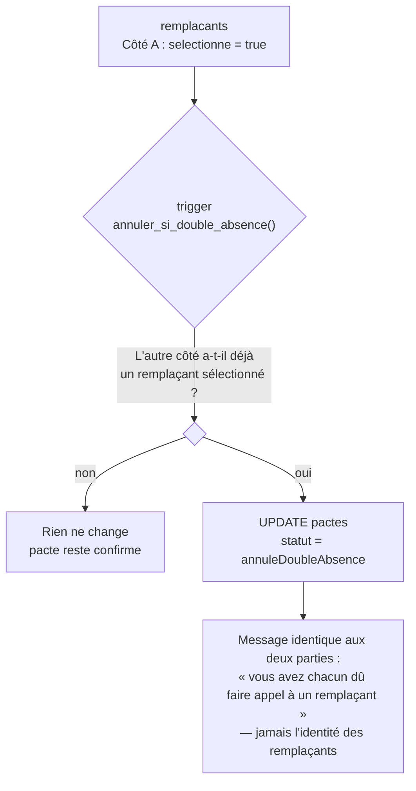
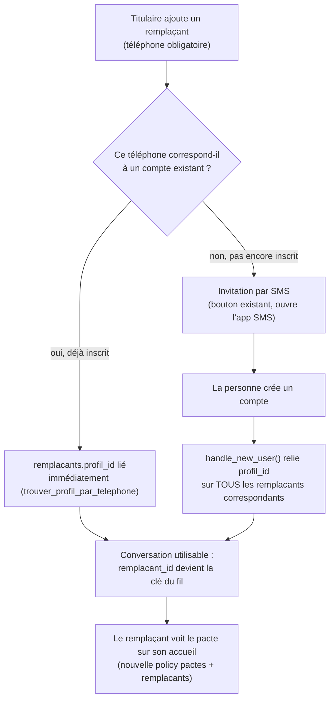

# Synthèse technique — Le Pacte

> **À maintenir à jour.** Ce document décrit l'état réel du produit et du code à un instant donné. Toute session de développement qui touche au schéma de données, aux règles de sécurité, au workflow de déploiement ou à une décision d'architecture doit mettre ce fichier à jour dans le même commit — pas après coup. Dernière mise à jour : **27 août 2026**.

## 1. Le produit

"Le Pacte" est une application où deux personnes fixent d'avance un déjeuner ou un dîner, sans savoir à l'avance qui — du titulaire ou d'un remplaçant — sera réellement présent le jour J. Chaque partie peut, à tout moment avant le jour J, déléguer sa présence à l'un de ses propres remplaçants, sans que l'autre partie ne le sache. Ce secret est la règle produit centrale et elle irrigue tout le modèle de données (section 4).

**V1 : si les deux parties délèguent leur présence, le pacte est annulé automatiquement.** Faire se rencontrer deux remplaçants qui ne se connaissent pas n'est pas géré pour l'instant (peut être gênant). Les deux sont prévenus (dans l'app pour l'instant, en attendant les notifications push) et peuvent recréer un pacte s'ils le souhaitent — voir section 4 (`statut = annuleDoubleAbsence`) et section 7.4.

## 2. Stack technique

| Couche | Choix | État |
|---|---|---|
| Frontend | Flutter (web + iOS/Android scaffoldés) | Web déployé et utilisé ; iOS/Android jamais publiés |
| Backend | Supabase (Postgres + Auth + Data API/PostgREST + RLS) | En production |
| Notifications push | Firebase Cloud Messaging (FCM), utilisé seul — pas tout Firebase | Prévu, pas encore implémenté |
| Analytics | PostHog | Prévu, pas encore implémenté |
| Hébergement web | GitHub Pages | En production, https://kevinarner.github.io/le_pacte/ |

Décision backend (voir historique de conversation) : Supabase a été choisi plutôt que Firestore/Firebase complet pour rester en SQL (équipe à l'aise avec SQL, besoin d'analyses facilement requêtables), viser 3+ ans sur les paliers gratuits pour ~5000 utilisateurs, et parce que FCM peut s'utiliser seul sans adopter tout l'écosystème Firebase.

### Dépendances Flutter clés (`pubspec.yaml`)
- `supabase_flutter` — client Supabase (Auth + Data API).
- `image_picker` — sélection de photo (profil), **stockage local uniquement pour l'instant, jamais envoyée à Supabase Storage**.
- `url_launcher` — ouverture du lien restaurant / SMS d'invitation.

## 3. Organisation Git & workflow de déploiement

- **Branche de développement** : `claude/github-files-list-vxwef9` — tout le code source y est commité.
- **`main`** : fast-forwardée pour matcher la branche de dev après chaque session (ne contient jamais de commit propre à elle).
- **`gh-pages`** : contient uniquement le **résultat compilé** (`flutter build web`), pas le code source. C'est elle que GitHub Pages sert.

Séquence de déploiement standard :
```bash
flutter build web --release --base-href /le_pacte/
# copier build/web/ sur la branche gh-pages (via un git worktree), commit, push
# puis fast-forward main sur la branche de dev
```

## 4. Modèle de données (Supabase / Postgres)

### `profiles`
Un compte = une ligne. `id` = `auth.uid()`. Colonnes : `prenom`, `nom`, `telephone`, `email`.
RLS : chacun ne voit/modifie que sa propre ligne. Créée automatiquement par le trigger `handle_new_user()` (section 5) au moment de l'inscription — jamais insérée depuis l'app.
**`telephone` est unique** (index unique partiel, `where telephone <> ''`, ajouté le 27/08 — voir section 8) : tout le rattachement automatique (destinataire, remplaçants) repose sur ce numéro comme identifiant fiable, ça ne peut fonctionner que si deux comptes ne peuvent jamais le partager.

### `restaurants`
Un seul restaurant en dur aujourd'hui (« Au père Lapin »), avec ses créneaux réels de déjeuner/dîner. Plusieurs restaurants proposés au choix est une évolution prévue mais pas commencée.
RLS : lecture publique pour `authenticated` (`using (true)`) — les infos du restaurant ne sont pas confidentielles. **Cette policy manquait initialement** (bug corrigé le 24/08 : la RLS était activée sans policy de lecture, ce qui bloquait tout accès avec une erreur 406 — voir section 8).

### `pactes`
La ligne partagée entre les deux parties. Deux catégories de colonnes bien distinctes :

**Colonnes accordées à `authenticated`** (lisibles/écrivables par l'app) : `id`, `type`, `statut`, `dates_proposees`, `date_retenue`, `nombre_echanges_date`, `restaurant_id`, `initiateur_id`, `initiateur_nom`, `destinataire_id`, `destinataire_nom`, `destinataire_telephone`, `created_at`.

**20 colonnes jamais accordées à `authenticated`** : `initiateur_remplacant_{1..5}_{nom,telephone}` et `destinataire_remplacant_{1..5}_{nom,telephone}`. Elles existent uniquement pour garder un historique permanent de « qui a remplacé qui », **lisible seulement via l'éditeur SQL Supabase ou le `service_role`**, jamais par l'app cliente — même après la fin du pacte. Remplies automatiquement par un trigger (section 5), jamais écrites par le code Flutter.

Ce cloisonnement colonne-par-colonne (`GRANT SELECT (col1, col2, ...) ON pactes TO authenticated`, tout le reste implicitement refusé) est le mécanisme qui rend ces 20 colonnes invisibles à l'app, en complément de la RLS classique (qui, elle, filtre les *lignes*, pas les colonnes).

`statut` (enum, valeurs exactes utilisées dans le code et en base) :
`enAttenteChoixDateDestinataire` → `enAttenteChoixDateInitiateur` (allers-retours de négociation de date, plafonnés à 2) → `enAttenteReponse` → `confirme` → `maintenu`, `annule`, ou `annuleDoubleAbsence` (les deux parties ont délégué leur présence — voir section 5 et 7.4).

Important : **aucun champ de statut de présence n'existe sur `pactes`**. Ni l'initiateur ni le destinataire ne peuvent lire, même indirectement, si l'autre partie a délégué sa présence — cette information vit exclusivement dans `remplacants`, cloisonnée par côté (voir ci-dessous). C'est une correction volontaire par rapport à une première version du schéma qui stockait un statut de présence par côté directement sur `pactes`.

### `remplacants`
Une ligne par remplaçant potentiel, propre à un pacte et à un côté (`cote` = `'initiateur'` ou `'destinataire'`) : `pacte_id`, `cote`, `prenom`, `nom`, `telephone` (obligatoire côté app depuis le 27/08 — nécessaire pour relier un compte), `email`, `selectionne` (booléen — celui-ci a été délégué), `profil_id` (nullable — rempli une fois que ce remplaçant a créé un compte, voir section 5 et 7.5).
RLS SELECT : **le titulaire du côté concerné**, OU **le remplaçant lui-même** une fois `profil_id` lié à son compte (ajouté le 27/08 — la policy initiale ne couvrait que le titulaire, pas le remplaçant, qui ne pouvait donc pas savoir sur quels pactes il avait été ajouté).
Plafond applicatif : 5 remplaçants maximum par côté (`RemplacantsForm.maximum` dans `lib/widgets/remplacants_form.dart`), pour que les 20 colonnes cachées de `pactes` puissent avoir un nombre fixe de colonnes.

### `messages`
Un fil de discussion privé par remplaçant (`remplacant_id`, `expediteur_id`, `contenu`, `created_at`) — pas de `pacte_id`/`cote` dupliqués, ils se retrouvent via `remplacant_id`. Voir section 7.5.
RLS : lisible/écrivable par le titulaire du côté concerné OU par le remplaçant lié (`remplacants.profil_id = auth.uid()`). Realtime activé (`alter publication supabase_realtime add table messages`) pour la réception en direct.

### `device_tokens`
Table créée en prévision des notifications push (FCM). **Non utilisée par le code Flutter actuel** — aucune logique de token push n'est encore implémentée côté client.

## 5. Fonctions & déclencheurs `SECURITY DEFINER`

Ces fonctions tournent avec les droits du propriétaire de la base, pas ceux de l'utilisateur connecté — elles contournent volontairement RLS/grants pour des opérations précises que l'app ne doit jamais faire elle-même.

- **`handle_new_user()`** — trigger `after insert` sur `auth.users`. Crée la ligne `profiles` correspondante, rattache automatiquement tout pacte en attente dont `destinataire_telephone` correspond au numéro du nouvel inscrit (met à jour `destinataire_id`), ET (depuis le 27/08) relie de la même façon tous les `remplacants.profil_id` correspondants — potentiellement plusieurs à la fois, un même numéro pouvant apparaître sur plusieurs pactes.
- **`synchroniser_remplacants_caches()`** — trigger `after insert/update/delete` sur `remplacants`. Recopie chaque remplaçant dans l'emplacement fixe correspondant parmi les 20 colonnes cachées de `pactes`, via `row_number() over (partition by cote order by id)`. C'est le seul mécanisme qui écrit dans ces 20 colonnes.
- **`trouver_profil_par_telephone(p_telephone text) returns uuid`** — RPC restreinte, appelée par l'app à la création d'un pacte (pour savoir si le destinataire a déjà un compte) et à l'ajout d'un remplaçant (pour lier `profil_id` immédiatement s'il a déjà un compte, sans attendre une inscription future). Ne renvoie qu'un UUID (ou rien), jamais les autres champs du profil — nécessaire car la RLS de `profiles` interdit sinon toute lecture du profil d'un tiers.
- **`annuler_si_double_absence()`** — trigger `after insert or update of selectionne` sur `remplacants`. Quand un côté sélectionne un remplaçant, vérifie si l'autre côté en a déjà un sélectionné pour ce même pacte ; si oui, bascule `pactes.statut` sur `annuleDoubleAbsence`. Doit obligatoirement tourner en `SECURITY DEFINER` : c'est le seul endroit du système qui a le droit de comparer les deux côtés d'un même pacte, l'app cliente n'ayant jamais accès aux remplaçants de l'autre partie (RLS par côté, section 4).
- **`est_remplacant_du_pacte(p_pacte_id uuid) returns boolean`** — utilisée par la policy SELECT de `pactes` qui laisse un remplaçant voir le pacte concerné (section 7.5). Ne peut pas être un simple `exists (select 1 from remplacants ...)` inline dans la policy : les policies de `remplacants` interrogent `pactes` en retour, ce qui crée une récursion infinie (`infinite recursion detected in policy for relation "pactes"`, code `42P17` — bug rencontré le 27/08, voir section 8). Passer par une fonction `SECURITY DEFINER` casse la boucle, puisqu'elle contourne la RLS de `remplacants` pour cette vérification précise.

## 6. Authentification

- Supabase Auth, email + mot de passe. Confirmation d'email **activée** (`Confirm email` = ON).
- **Site URL** Supabase configuré sur `https://kevinarner.github.io/le_pacte/` (piège initial : reste par défaut sur `http://localhost:3000`, ce qui casse le lien de confirmation reçu par email — voir section 8).
- `AppStore.moi` (`lib/services/app_store.dart`) est l'unique source de vérité de l'identité connectée. Remplacée après un login/signup réussi par `LoginScreen._chargerProfilEtEntrer()`, qui va chercher la ligne `profiles` correspondante.
- **Le mécanisme de simulation « Moi / Mon ami » (`perspectiveMoi`)**, utilisé dans les premières versions pour tester les deux côtés d'un pacte dans un seul navigateur, **a été entièrement retiré**. Il était devenu incompatible avec RLS : la sécurité au niveau ligne résout toujours l'identité *réellement* connectée (`auth.uid()`), quel que soit un éventuel bouton de bascule dans l'UI.

## 7. Cycle de vie d'un pacte

### 7.1 Création



Si le destinataire n'a pas encore de compte, `destinataire_id` reste `NULL` mais rien n'est perdu : `destinataire_nom` et `destinataire_telephone` sont conservés, et `handle_new_user()` rattachera automatiquement le pacte dès que cette personne créera un compte avec le même numéro.

### 7.2 Acceptation ou refus



La négociation de date (contre-proposition) est plafonnée à 2 allers-retours (`nombreEchangesDate` / `maxEchangesDate` dans `bloc_choix_date.dart`) ; au-delà, la seule option restante est d'accepter une des dates proposées ou d'annuler.

### 7.3 Accepté, puis délégué à un remplaçant



Point clé : la substitution ne touche **aucune colonne lisible par l'app** sur `pactes`. L'autre partie n'a littéralement aucune donnée lui indiquant qu'une substitution a eu lieu — pas seulement un nom caché. Le trigger `synchroniser_remplacants_caches()` écrit bien un historique sur `pactes`, mais dans les 20 colonnes jamais accordées à `authenticated` : cet historique n'existe que pour une consultation manuelle via l'éditeur SQL, jamais pour l'app.

### 7.4 Les deux délèguent : annulation automatique (V1)

Décision V1 (24/08) : faire se rencontrer deux remplaçants qui ne se connaissent pas n'est pas géré pour l'instant — si les deux parties délèguent, le pacte est annulé plutôt que de les mettre en contact.



Points volontaires de cette conception :
- **Annulation immédiate**, dès la seconde délégation — pas d'attente d'une échéance J-1.
- **Le message révèle le fait mutuel** (les deux ont délégué) **mais jamais l'identité** des remplaçants — cohérent avec la règle de secret, puisque ce fait-là ne devient vrai, et donc partageable, que lorsqu'il concerne les deux parties à la fois.
- **Pas de notification push pour l'instant** : la partie qui délègue en second voit le changement immédiatement (l'app relit le statut juste après son action) ; l'autre partie le verra en rouvrant l'app. Un vrai push sera branché sur cet événement une fois FCM en place.

### 7.5 Chat titulaire ↔ remplaçants (27/08)

Objectif produit : donner une raison de revenir régulièrement dans l'app, et faire connaître l'app via les remplaçants invités. Un fil de discussion privé s'ouvre automatiquement dès qu'un remplaçant crée un compte — pour **tous** les remplaçants potentiels d'un côté (jusqu'à 5), pas seulement celui finalement délégué.



Décisions retenues :
- **Un fil par (pacte, remplaçant)**, pas un fil persistant qui traverserait plusieurs pactes — colle au modèle actuel où un remplaçant est ressaisi à chaque pacte (pas de liste de contacts réutilisable).
- **Accessible en permanence** une fois le pacte confirmé, pas seulement au moment de se désister : `MesRemplacantsScreen` (qui remplace l'ancien `ChoisirRemplacantScreen`) permet d'ajouter des remplaçants à tout moment, avant même d'en avoir besoin.
- **Le destinataire renseigne aussi ses remplaçants pour accepter** (`BlocReponse`), symétriquement à l'initiateur qui le fait déjà à la création — sinon son chat resterait vide en pratique.
- Deux policies RLS ont dû être **ajoutées** (pas remplacées) pour que ce flux fonctionne : un remplaçant doit pouvoir voir sa propre fiche `remplacants` et le `pactes` concerné, ce qu'aucune policy existante ne permettait (elles ne couvraient que les titulaires).

## 8. Bugs rencontrés et corrigés (pour ne pas les refaire)

| Symptôme | Cause | Correction |
|---|---|---|
| "Impossible de joindre le serveur" au login/signup, aucune requête réseau visible | `MissingPluginException` sur `shared_preferences` en web — enregistrement de plugin périmé après ajout de `supabase_flutter` | `flutter clean` + `flutter pub get` + rebuild |
| Lien de confirmation d'email renvoie vers `localhost:3000` et une page d'erreur | Site URL Supabase resté sur sa valeur par défaut | Authentication → URL Configuration → Site URL = URL de prod, + ré-inscription pour un lien frais |
| Écran d'accueil bloqué sur un chargement infini après connexion | RLS activée sur `restaurants` sans aucune policy de lecture → 406 de Supabase, et aucune gestion d'erreur côté app pour l'afficher | Policy `using (true)` sur `restaurants` + gestion d'erreur explicite (message + bouton Réessayer) dans `AccueilScreen`/`CreerPacteScreen` |
| La policy initiale de `remplacants` laissait chaque partie voir les remplaçants de l'autre | La condition RLS vérifiait "ce pacte m'appartient" sans vérifier "ce côté est le mien" | Policy réécrite pour vérifier `cote = 'initiateur' and initiateur_id = auth.uid()` (et son symétrique) |
| `PostgrestException: infinite recursion detected in policy for relation "pactes"` (code `42P17`) au chargement de l'accueil | La policy laissant un remplaçant voir le pacte concerné interrogeait `remplacants`, dont les policies interrogent `pactes` en retour — boucle infinie | Passer par la fonction `SECURITY DEFINER` `est_remplacant_du_pacte()`, qui contourne la RLS de `remplacants` pour cette vérification et casse la boucle |
| Le destinataire d'un pacte ne voyait pas la proposition, alors qu'elle avait bien été créée | Deux comptes différents avaient le même numéro de téléphone (aucune contrainte ne l'empêchait) ; `trouver_profil_par_telephone()` (`... limit 1`) a résolu vers le mauvais profil, donc `destinataire_id` ne pointait pas vers le bon compte | Index unique partiel sur `profiles.telephone` (`where telephone <> ''`) — empêche désormais deux comptes de partager un numéro, avec un message clair à l'inscription si ça arrive |

## 9. État actuel

**Fait et déployé :**
- Authentification réelle (Supabase Auth), création de profil automatique, rattachement automatique par téléphone.
- Cycle de vie complet d'un pacte : création, négociation de date (max 2 allers-retours), acceptation/refus, délégation à un remplaçant, statuts `confirme`/`maintenu`/`annule`/`annuleDoubleAbsence`.
- Annulation automatique si les deux parties délèguent leur présence (V1 — pas de mise en contact entre remplaçants).
- Chat privé en temps réel entre un titulaire et chacun de ses remplaçants, dès que ceux-ci ont un compte — ouverture automatique par rattachement téléphone, écran permanent pour gérer sa liste et déléguer.
- Confidentialité par côté appliquée à la fois par RLS (lignes) et par grants de colonnes (historique permanent invisible à l'app).

**Prévu, pas commencé :**
- Notifications push (FCM) — table `device_tokens` existe, aucun code client.
- Analytics (PostHog).
- Plusieurs restaurants au choix (un seul en dur aujourd'hui).
- Upload réel des photos de profil/remplaçants (actuellement local au navigateur, jamais envoyé à Supabase Storage).
- Vraies relances automatiques J-7/J-3/J-1 (`BlocCascade` n'est aujourd'hui qu'une simulation manuelle par boutons).
- Nom définitif de l'application (bloque la création du compte Firebase, donc la publication TestFlight/Play Store) ; identifiants provisoires : iOS `com.kevinarner.lePacte`, Android `com.kevinarner.le_pacte`.
- `ios/` et `android/` sont scaffoldés (`flutter create`) mais l'app n'a jamais été publiée sur aucun store.
